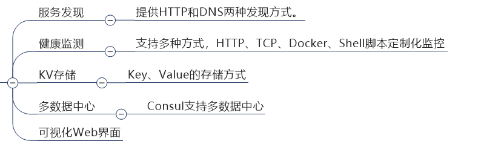
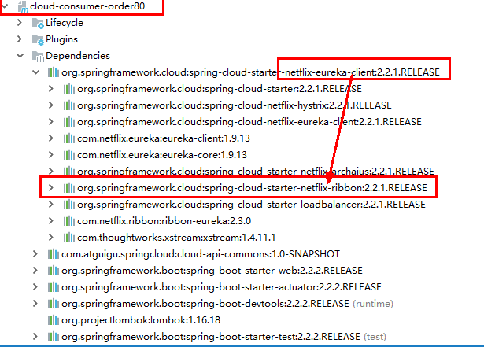
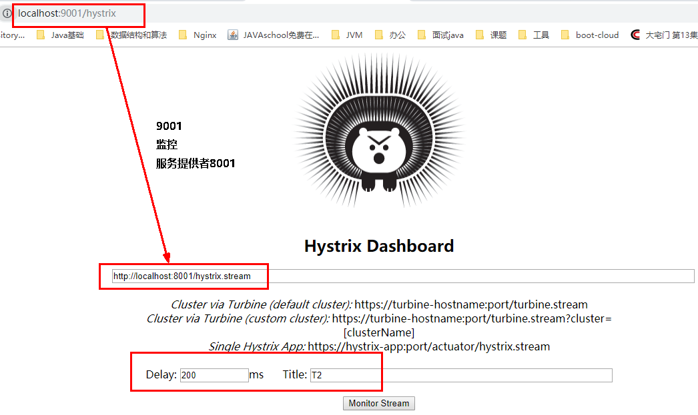
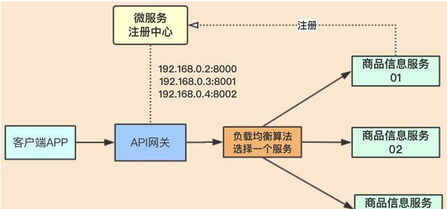
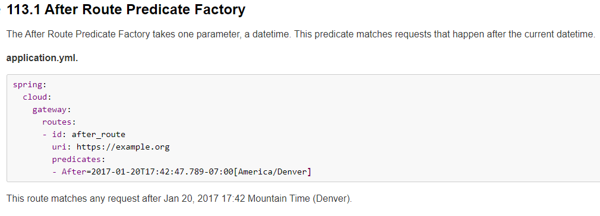
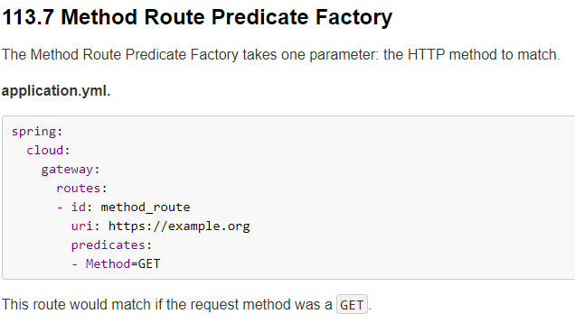
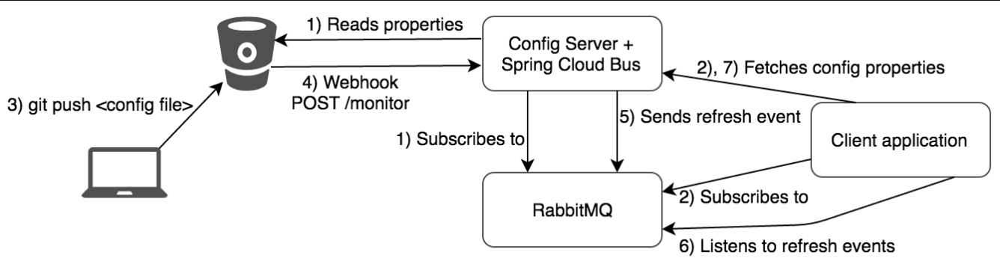
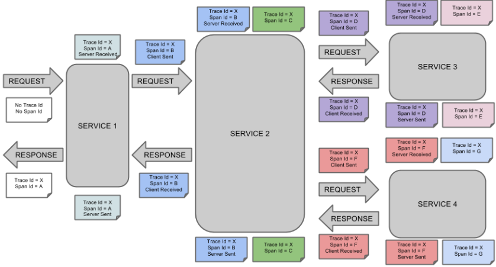
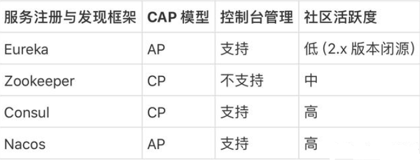

# 一、JAVA基础

## （一）、对象的五种创建方式

```java
public class Test {
    public static void main(String[] args) throws IllegalAccessException, InstantiationException, InvocationTargetException, CloneNotSupportedException {
        /*1、new 调用构造方法*/
        Person person = new Person();
        System.out.println(person);
        /*2、class.newInstance 调用默认的无参构造方法即可*/
        person = Person.class.newInstance();
        System.out.println(person);
        /*3、Constructor.newInstance 调用显示的无参构造方法*/
        Constructor<?>[] constructors = Person.class.getConstructors();
        person = (Person)constructors[0].newInstance();
        System.out.println(person);
        /*4、clone 不调用构造方法*/
        person = person.clone();
        System.out.println(person);
        /*5、反序列化 不调用构造方法*/
        byte[] bytes = SerializationUtils.serialize(person);
        // 字节数组：可以来自网络、可以来自文件（本处直接本地模拟）
        person = (Person) SerializationUtils.deserialize(bytes);
        System.out.println(person);
    }
}

class Person implements Cloneable, Serializable {
    private static final long serialVersionUID = -8390192756997145894L;
    private String name;
    private Integer age;
    public Person(){}
    @Override
    public Person clone() throws CloneNotSupportedException {
        return (Person) super.clone();
    }
}
```

## （二）、静态代码块与构造函数的运行顺序

```java
public class Test {
    public static void main(String[] args) {
        S s = new S();
        System.out.println("=============");
        S s1 = new S(1);
    }
}
class F {
    private static Parameter parameter1 = new Parameter("父类的静态成员变量");
    private  Parameter parameter2 = new Parameter("父类的非静态成员变量");
    static {
        System.out.println("父类静态代码块");
    }
    {
        System.out.println("父类构造代码块");
    }
    public F() {
        System.out.println("父类无参构造方法");
    }
    public F(int num) {
        System.out.println("父类有参构造方法");
    }
}

class S extends F {
    private static Parameter parameter1 = new Parameter("子类的静态成员变量");
    private  Parameter parameter2 = new Parameter("子类的非静态成员变量");
    static {
        System.out.println("子类静态代码块");
    }
    {
        System.out.println("子类构造代码块");
    }
    public S() {
        System.out.println("子类无参构造方法");
    }
    public S(int num) {
        System.out.println("子类有参构造方法");
    }
}

class Parameter{
    public Parameter(String str){
        System.out.println(str);
    }
}

/*
父类的静态成员变量
父类静态代码块
子类的静态成员变量
子类静态代码块
父类的非静态成员变量
父类构造代码块
父类无参构造方法
子类的非静态成员变量
子类构造代码块
子类无参构造方法
=============
父类的非静态成员变量
父类构造代码块
父类无参构造方法
子类的非静态成员变量
子类构造代码块
子类有参构造方法
*/
```

> 加载顺序：
>
> `特别注意：`静态代码块和静态成员变量之间的具体加载顺序由编写顺序决定，构造代码块与非静态成员变量之间的具体加载顺序同样由编写顺序决定。
>
> 1. 父类的静态成员变量 以及父类静态代码块（==只会加载一次==）
> 2.  子类的静态成员变量 以及子类的静态代码块 （==只会加载一次==）
> 3. 父类的非静态成员变量以及父类构造代码块 （==以下是有多少个对象就会加载多少次==） 
> 4.   父类无参构造方法  
> 5. 子类的非静态成员变量以及子类构造代码块 
> 6.  子类调用的构造方法 

## （三）、类加载器

## （四）、final

> 1. final修饰==类==时，表明这个类不能被继承
> 2. final修饰==⽅法==，表明⽅法不能被重写
> 3. final修饰==变量==，如果是==基本数据类型==的变量，则其数值⼀旦在初始化之后便不能改变；如果是==对象类型（引用类型）==的变量，只能保证它的引⽤不变，但对象的内容是可以改变的  。
> 4. final还可以修饰在⽅法的==⼊参==上，表示在⽅法内部不允许对参数进⾏修改  

**特别注意**

Java中数组也是对象，对象数组即使被final修饰，内容还是可以改变的。

```java
final int array[] = {1, 2, 3};
for (int i = 0; i < array.length; i++) {
	array[i] += 10;
	System.out.println(array[i]);
}
```


## （五）、String

****

```java
String str1 = "abc";
String str2 = "abc";
// true
System.out.println(str1 == str2);
```

​		采⽤==字⾯值==的⽅式创建⼀个字符串时， JVM⾸先会去字符串池中查找是否存在"abc"这个对象的引⽤如果不存在，则在堆中创"abc"这个对象，并将其引⽤添加到字符串常量池（实际上是将引⽤放到哈希表中），随后将引⽤赋给str1。

​		如果存在，则不创建任何对象，直接将池中"abc"对象的引⽤返回，赋给str2。因为str1、 str2指向同⼀个对象，所以结果为true。  

```java
String str3 = new String("abc");
String str4 = new String("abc");
// false
System.out.println(str3 == str4);
```

​		采⽤==new关键字新建⼀个字符串对象==时， JVM⾸先在字符串池中查找有没有"abc"这个字符串对象的引⽤如果没有，则先在堆中创建⼀个"abc"字符串对象，并将引⽤添加到字符串常量池，随后将引⽤赋给str3

​		如果有，则不往池中放"abc"对象的引⽤，直接在堆中创建⼀个"abc"字符串对象，然后将引⽤赋给str4。这样， str4就指向了堆中创建的这个"abc"字符串对象；
​		因为str3和str4指向的是不同的字符串对象，结果为false。*  

# 二、SpringCloud

## （一）、Eureka服务注册与发现

> 官网地址：https://github.com/Netflix/eureka/wiki

三大组件:`服务治理服务器（Eureka）`、`服务注册代理（服务提供者）`以及`服务发现客户端（服务消费者）`。

优点：

(1)、更高的可用性，只用知道服务名称，不一定需要知道服务的物理地址;

(2)、负载均衡，分摊到所有服务实例；

(3)、提升应用的弹性，服务实例复制到本地，服务治理服务器挂了，也可以通过缓存去访问；

(4)、高可用性集群

​		Eureka采用了CS的设计架构，Eureka Server 作为服务注册功能的服务器，它是服务注册中心。而系统中的其他微服务，使用 Eureka的客户端连接到 Eureka Server并维持心跳连接。这样系统的维护人员就可以通过 Eureka Server 来监控系统中各个微服务是否正常运行。
​		在服务注册与发现中，有一个注册中心。当服务器启动的时候，会把当前自己服务器的信息（比如：服务地址、通讯地址等）以别名方式注册到注册中心上。另一方（消费者|服务提供者），以该别名的方式去注册中心上获取到实际的服务通讯地址，然后再实现本地RPC调用。

> RPC远程调用框架核心设计思想：在注册中心管理每个服务与服务之间的一个依赖关系(服务治理概念)。在任何rpc远程框架中，都会有一个注册中心，用于存放服务地址相关信息(接口、地址)。

****

### 1、单机搭建

```shell
<dependency>
    <groupId>org.springframework.cloud</groupId>
    <artifactId>spring-cloud-starter-netflix-eureka-server</artifactId>
</dependency>

<dependency>
	<groupId>org.springframework.cloud</groupId>
	<artifactId>spring-cloud-starter-netflix-eureka-client</artifactId>
</dependency>

@EnableEurekaServer # 开启Eureka服务相关功能
@EnableEurekaClient # 开启Eureka客户端功能

eureka.instance.prefer-ip-address=true # 
eureka.client.register-with-eureka=true # 当前服务是否需要注册到治理中心，是否从EurekaServer抓取已有的注册信息，默认为true。单节点无所谓，集群必须设置为true才能配合ribbon使用负载均衡
eureka.client.fetch-registry=true # 是否需要将注册中心的服务列表同步到本地
eureka.client.service-url.defaultZone=http://localhost:8260/eureka # Eurake的服务地址
instanceId # 也就是微服务实例ID，用来标识每一个注册到Eureka服务器中的服务实例，默认情况下该值是由：服务宿主机器名称+服务名称+端口号构成
eureka.client.registry-fetch-interval-seconds=30 #
```

### 2、集群

****

> **问题：微服务RPC远程服务调用最核心的是什么？**
>
> 高可用，试想你的注册中心只有一个， 它出故障了那就无法实现远程调用，会导致整个为服务环境不可用，==所以解决办法：搭建Eureka注册中心集群 ，实现负载均衡+故障容错==

```shell
# 等同于同时部署多个Eureka服务,各Eureka服务之间相互注册
eureka:
  instance:
    hostname: eureka7002.com #eureka服务端的实例名称
  client:
    register-with-eureka: false     #false表示不向注册中心注册自己。
    fetch-registry: false     #false表示自己端就是注册中心，我的职责就是维护服务实例，并不需要去检索服务
    service-url:
      defaultZone: http://eureka7001.com:7001/eureka/ 
      # 此处填写需要注册到的Eureka地址，如果是要注册到多个，多个地址之间用逗号隔开
      # http://#{eureka.instance.hostname}:#{port}/eureka/
      # 对应的客户端服务同样需要注册到集群所有的Eureka服务上
```

​		此时，如果访问服务提供者，不具备负载均衡功能，需要在`RestTemplate `的bean上加注解`@LoadBalanced`，

```java
@Configuration
public class ApplicationContextBean
{
    @Bean
    @LoadBalanced //使用@LoadBalanced注解赋予RestTemplate负载均衡的能力
    public RestTemplate getRestTemplate()
    {
        return new RestTemplate();
    }
}
```

RPC服务调用的路径中使用在Eureka上注册成功的服务名称，不能写指定的地址和端口：

```java
public static final String PAYMENT_SRV = "http://CLOUD-PAYMENT-SERVICE";
```

### 3、微服务信息完善

**3.1、主机名称:服务名称修改**

****

```shell
# 注册服务中显示了主机名称
eureka.instance.instance-id=payment8001
```

****

**3.2、访问信息有IP信息提示**

```shell
eureka.instance.prefer-ip-address=true #访问路径可以显示IP地址
```

****

### 4、服务发现Discovery

对于注册进eureka里面的微服务，可以通过服务发现来获得该服务的信息。

```java
@EnableDiscoveryClient // 主程序需要添加该注解

@RestController
@Slf4j
public class PaymentController
{
    @Resource
    private DiscoveryClient discoveryClient;

    @GetMapping(value = "/payment/discovery")
    public Object discovery()
    {
        List<String> services = discoveryClient.getServices();
        for (String element : services) {
            System.out.println(element);
        }

        List<ServiceInstance> instances = discoveryClient.getInstances("CLOUD-PAYMENT-SERVICE");
        for (ServiceInstance element : instances) {
            System.out.println(element.getServiceId() + "\t" + element.getHost() + "\t" + element.getPort() + "\t"
                    + element.getUri());
        }
        return this.discoveryClient;
    }
}
```

### 5、Eureka自我保护

​		保护模式主要用于一组客户端和Eureka Server之间存在==网络分区场景下==的保护。一旦进入保护模式，Eureka Server将会==尝试保护其服务注册表中的信息，不再删除服务注册表中的数据，也就是不会注销任何微服务==。

​		为了保证EurekaClient可以正常运行，但是 与 EurekaServer网络不通情况下，EurekaServer不会立刻将EurekaClient服务剔除。

​		默认情况下，如果EurekaServer在一定时间内没有接收到某个微服务实例的心跳，EurekaServer将会注销该实例（==默认90秒==）。但是当网络分区故障发生(延时、卡顿、拥挤)时，微服务与EurekaServer之间无法正常通信，以上行为可能变得非常危险了——因为微服务本身其实是健康的，此时本不应该注销这个微服务。Eureka通过“自我保护模式”来解决这个问题——当EurekaServer节点在短时间内丢失过多客户端时（可能发生了网络分区故障），那么这个节点就会进入自我保护模式。**

****

```shell
eureka.server.enable-self-preservation=true # 自我保护机制是开启的,可以通过该参数进行关闭
# 心跳检测与续约时间
# 开发时设置小些，保证服务关闭后注册中心能即使剔除服务
eureka.instance.lease-renewal-interval-in-seconds=1   
# Eureka客户端向服务端发送心跳的时间间隔，单位为秒(默认是30秒)
eureka.instance.lease-expiration-duration-in-seconds=2
# Eureka服务端在收到最后一次心跳后等待时间上限，单位为秒(默认是90秒)，超时将剔除服务
```

## （二）、Zookeeper服务注册于发现

```shell
<!-- SpringBoot整合zookeeper客户端 -->
<dependency>
	<groupId>org.springframework.cloud</groupId>
	<artifactId>spring-cloud-starter-zookeeper-discovery</artifactId>
</dependency>

# 服务别名----注册zookeeper到注册中心名称
spring.cloud.zookeeper.connect-string=192.168.111.144:2181
# 主启动类添加该注解，用于向使用consul或者zookeeper作为注册中心时注册服务
@EnableDiscoveryClient 


```

****

创建消费者服务，同样使用`RestTemplate `进行调用。

注意zookeeper版本，如果版本不一致，

```shell
 <!-- SpringBoot整合zookeeper客户端 -->
<dependency>
	<groupId>org.springframework.cloud</groupId>
	<artifactId>spring-cloud-starter-zookeeper-discovery</artifactId>
	<!--先排除自带的zookeeper3.5.3-->
		<exclusions>
			<exclusion>
				<groupId>org.apache.zookeeper</groupId>
                <artifactId>zookeeper</artifactId>
            </exclusion>
        </exclusions>
</dependency>
<!--添加zookeeper3.4.9版本-->
<dependency>
	<groupId>org.apache.zookeeper</groupId>
	<artifactId>zookeeper</artifactId>
	<version>3.4.9</version>
</dependency>
```

## （三）、Consul服务注册与发现

> [官网地址](https://www.consul.io)、[文档地址](https://www.springcloud.cc/spring-cloud-consul.html)、[安装说明地址](https://learn.hashicorp.com/consul/getting-started/install.html)

​		Consul 是一套开源的分布式服务发现和配置管理系统，由 HashiCorp 公司用 Go 语言开发。

​		提供了微服务系统中的`服务治理`、`配置中心`、`控制总线`等功能。这些功能中的每一个都可以根据需要单独使用，也可以一起使用以构建全方位的服务网格，总之Consul提供了一种完整的服务网格解决方案。

​		它具有很多优点。包括： 基于 raft 协议，比较简洁； 支持健康检查, 同时支持 HTTP 和 DNS 协议，支持跨数据中心的 WAN 集群 提供图形界面 跨平台，支持 Linux、Mac、Windows。**

****

```shell
    <dependencies>
        <!--SpringCloud consul-server -->
        <dependency>
            <groupId>org.springframework.cloud</groupId>
            <artifactId>spring-cloud-starter-consul-discovery</artifactId>
        </dependency>
        <!-- SpringBoot整合Web组件 -->
        <dependency>
            <groupId>org.springframework.boot</groupId>
            <artifactId>spring-boot-starter-web</artifactId>
        </dependency>
        <dependency>
            <groupId>org.springframework.boot</groupId>
            <artifactId>spring-boot-starter-actuator</artifactId>
        </dependency>
	<dependencies>
	
	
	
spring:
####consul注册中心地址
  cloud:
    consul:
      host: localhost
      port: 8500
      discovery:
        #hostname: 127.0.0.1
        service-name: ${spring.application.name}
        
@EnableDiscoveryClient # 该注解用于向使用consul或者zookeeper作为注册中心时注册服务
```

创建消费者服务，同样使用`RestTemplate `进行调用。

##  （四）、服务注册与发现的对比情况

​		CAP定理，简单来说就是分布式系统不可能同时满⾜`Consistency` ⼀致性、` Availability `可⽤性、`Partition Tolerance `分区容错性三个要素 。**

****

**Consistency ⼀致性**
		⼀致性的含义为，在节点的任意时刻，访问任意节点返回的数据是⼀致的。即Client端写⼊⼀个数据后，Server端将数据同步到整个系统，从⽽保证系统的数据都相同 。

**Availability 可⽤性**
		可⽤性的含义为，集群能够对⽤户的请求给予响应。

**Partition Tolerance 分区容错性**   

​		分区容错的含义为，当出现分区故障时，系统仍要对外提供服务。分布式系统中，每个服务节点都是不可靠的，当某些节点出现异常时，或者节点之间的通讯产⽣异常时，整个系统就产⽣了分区问题，分布式系统中分区问题是客观存在的。

**CAP权衡 -CA**

​		系统选择CA，即不⽀持分区容错，只⽀持⼀致性和可⽤性。意味着不允许出现分区异常，⽹络一直处于理想状态。但是分布式系统之间==⽹络异常是客观存在的，如果避免了P，只能把分布式系统退回到==单实例系统。  

**CAP权衡 -CP**

​		因为分布式系统`P`是客观存在的，所以我们要在`CP`和`AP`之间进⾏抉择。当选择`CP`时，相当于放弃系统的可⽤性，换取⼀致性。 `zookeeper`是选择了`CP`的系统 。

****

​		在`zookeeper`集群中，有如下三种⻆⾊

| 角色     | 作用                                                       |
| -------- | ---------------------------------------------------------- |
| Leader   | 事务请求的唯一调度者和处理者（事务请求为除查询之外的请求） |
| Follower | 处理非事务请求，参与Leader的选举投票                       |
| Observer | 处理非事务请求，不参与Leader的选举投票                     |

​		在`Leader`服务器失效时，会重新从`Follower`服务器中选举⼀个新的服务器作为`Leader`服务器。 在重新选举Leader服务器的过程中，==事务请求会被挂起==，选举完Leader服务器之后才会执⾏这些请求。即为了==保证⼀致性，放弃了系统的可⽤性==。

**CAP权衡 -AP**

​		当选择`AP`时，相当于放弃系统⼀致性，换取可⽤性。 `eureka`是选择了`AP`的系统，和`zookeeper`集群中有三种⻆⾊不同的是， ==eureka集群中每个节点扮演相同的⻆⾊==，他们通过互相注册的⽅式来感知对⽅的存在，当有注册信息时，他们会同步给集群内的其他节点。 

****

​		eureka注册中⼼的信息保存在`AbstractInstanceRegistry`类的成员变量中

```java
// AbstractInstanceRegistry
private final ConcurrentHashMap<String, Map<String, Lease<InstanceInfo>>> registry
		= new ConcurrentHashMap<String, Map<String, Lease<InstanceInfo>>>();  
```

****

​		当有服务往`eureka`上注册时，注册信息会被保存在`map`中，同时会把信息同步给其他的节点。此时有可能有些节点不可⽤了，或者⽹络故障，并没有收到信息，此时集群节点内的信息可能是不⼀致的。

​		当客户端从某个`eureka`节点获取信息失败，或者注册失败，会⾃动切换到另⼀个eureka节点。只要有⼀台eureka节点可⽤，就能保证注册服务可⽤。  

****

## （五）、Ribbon负载均衡

> [官网地址](https://github.com/Netflix/ribbon/wiki/Getting-Started)

### 1、概念

​		Spring Cloud Ribbon是基于Netflix Ribbon实现的一套客户端、负载均衡的工具。简单的说，Ribbon是Netflix发布的开源项目，主要功能是提供客户端的==软件负载均衡算法和服务调用==。Ribbon客户端组件提供一系列完善的配置项如==连接超时，重试==等。在配置文件中列出`Load Balancer（简称LB）`后面所有的机器，Ribbon会自动的帮助你基于某种规则（如简单轮询，随机连接等）去连接这些机器。

​		LB负载均衡(Load Balance)：将用户的请求平摊的分配到多个服务上，从而达到系统的HA（高可用）。常见的负载均衡有软件Nginx，LVS，硬件 F5等。

Ribbon本地负载均衡客户端 VS Nginx服务端负载均衡区别
		 Nginx：`服务器负载均衡`，客户端所有请求都会交给nginx，然后由nginx实现转发请求。即负载均衡是由服务端实现的。

 		Ribbon：`本地负载均衡`，在调用微服务接口时候，会在注册中心上获取注册信息服务列表之后==缓存到JVM本地==，从而在本地实现RPC远程服务调用技术。

​		集中式LB：即在服务的消费方和提供方之间使用独立的LB设施(可以是硬件，如`F5`, 也可以是软件，如`nginx`), 由该设施负责把访问请求通过某种策略转发至服务的提供方；

​		进程内LB：将LB逻辑==集成到消费方==，消费方从服务注册中心获知有哪些地址可用，然后自己再从这些地址中选择出一个合适的服务器。`Ribbon`就属于进程内LB，它只是一个类库，集成于消费方进程，消费方通过它来获取到服务提供方的地址。

Ribbon在工作时分成两步：
		第一步先选择 Eureka Server ,它优先选择在同一个区域内负载较少的server.
		第二步再根据用户指定的策略，在从server取到的服务注册列表中选择一个地址。**

****

### 2、使用

```shell
<dependency>
    <groupId>org.springframework.cloud</groupId>
    <artifactId>spring-cloud-starter-netflix-ribbon</artifactId>
</dependency>
```

没有引入spring-cloud-starter-ribbon也可以使用ribbon，spring-cloud-starter-netflix-eureka-client 引入了Ribbon。

****

### 3、RestTemplate的使用

> [官网](https://docs.spring.io/spring-framework/docs/5.2.2.RELEASE/javadoc-api/org/springframework/web/client/RestTemplate.html)

返回对象为响应体中数据转化成的对象，基本上可以理解为Json

****

返回对象为ResponseEntity对象，包含了响应中的一些重要信息，比如响应头、响应状态码、响应体等

****

### 4、核心组件IRule

> 根据特定算法中从服务列表中选取一个要访问的服务

****

****

### 5、配置自定义的Rule规则

> 官方文档明确给出了警告：这个自定义配置类`不能`放在`@ComponentScan`所扫描的当前包下以及子包下，否则我们自定义的这个配置类就会被所有的Ribbon客户端所共享，达不到特殊化定制的目的了。

****

```java
@Configuration
public class MySelfRule
{
    @Bean
    public IRule myRule()
    {
        return new RandomRule();//定义为随机
    }
}

@RibbonClient(name = "CLOUD-PAYMENT-SERVICE",configuration=MySelfRule.class)
public class OrderMain80
{
    public static void main(String[] args)
    {
        SpringApplication.run(OrderMain80.class,args);
    }
}
```

### 6、负载均衡算法

> 负载均衡算法：rest接口第几次请求数 % 服务器集群总数量 = 实际调用服务器位置下标  ，每次服务重启动后rest接口计数`从1开始`。
>
> List<ServiceInstance> instances = discoveryClient.getInstances("CLOUD-PAYMENT-SERVICE");
>
> 如：   List [0] instances = 127.0.0.1:8002
> 　　　List [1] instances = 127.0.0.1:8001
>
> 8001+ 8002 组合成为集群，它们共计2台机器，集群总数为2， 按照轮询算法原理：
>
> 当总请求数为1时： 1 % 2 =1 对应下标位置为1 ，则获得服务地址为127.0.0.1:8001
> 当总请求数位2时： 2 % 2 =0 对应下标位置为0 ，则获得服务地址为127.0.0.1:8002
> 当总请求数位3时： 3 % 2 =1 对应下标位置为1 ，则获得服务地址为127.0.0.1:8001
> 当总请求数位4时： 4 % 2 =0 对应下标位置为0 ，则获得服务地址为127.0.0.1:8002
> 如此类推......

```java
// 服务提供者
@RestController
@Slf4j
public class PaymentController{
    @Value("${server.port}")
    private String serverPort;

    @GetMapping(value = "/payment/lb")
    public String getPaymentLB(){
        return serverPort;
    }
}
```

```java
// 自定义的负载均衡算法
public interface LoadBalancer{
    ServiceInstance instances(List<ServiceInstance> serviceInstances);
}
@Component
public class MyLB implements LoadBalancer{
    private AtomicInteger atomicInteger = new AtomicInteger(0);

    public final int getAndIncrement(){
        int current;
        int next;
        do{
            current = this.atomicInteger.get();
            next = current >= 2147483647 ? 0 : current + 1;
        } while(!this.atomicInteger.compareAndSet(current, next));
        System.out.println("*****next: "+next);
        return next;
    }

    @Override
    public ServiceInstance instances(List<ServiceInstance> serviceInstances){
        int index = getAndIncrement() % serviceInstances.size();
        return serviceInstances.get(index);
    }
}

// 服务调用类
@Configuration
public class ApplicationContextBean{
    @Bean
    public RestTemplate getRestTemplate(){
        return new RestTemplate();
    }
}

@RestController
public class OrderController{
    public static final String PAYMENT_SRV = "http://CLOUD-PAYMENT-SERVICE";

    @Resource
    private RestTemplate restTemplate;
    //可以获取注册中心上的服务列表
    @Resource
    private DiscoveryClient discoveryClient;
 
    @Resource
    private LoadBalancer loadBalancer;

    @GetMapping("/consumer/payment/lb")
    public String getPaymentLB(){
        List<ServiceInstance> instances = discoveryClient.getInstances("CLOUD-PAYMENT-SERVICE");
        if(instances == null || instances.size()<=0){
            return null;
        }
        ServiceInstance serviceInstance = loadBalancer.instances(instances);
        URI uri = serviceInstance.getUri();
        return restTemplate.getForObject(uri+"/payment/lb",String.class);
    }
}
```

## （六）、OpenFeign服务接口调用

> [官网地址](https://github.com/spring-cloud/spring-cloud-openfeign)、[官网地址](https://cloud.spring.io/spring-cloud-static/Hoxton.SR1/reference/htmlsingle/#spring-cloud-openfeign)

### 1、概述

​		Feign是一个声明式Web Service客户端。使用Feign能让编写Web Service客户端更加简单。==它的使用方法是定义一个服务接口，然后在上面添加注解==。Feign也支持可拔插式的编码器和解码器。Spring Cloud对Feign进行了封装，使其支持了`Spring MVC`标准注解和`HttpMessageConverters`。Feign可以与Eureka和Ribbon组合使用以支持负载均衡。

****

> Feign能干什么?
> Feign旨在使编写Java Http客户端变得更容易。在使用`Ribbon+RestTemplate`时，利用`RestTemplate`对`http`请求的封装处理，形成了一套模版化的调用方法。但是在实际开发中，由于对服务依赖的调用可能不止一处，==往往一个接口会被多处调用，所以通常都会针对每个微服务自行封装一些客户端类来包装这些依赖服务的调用==。所以，Feign在此基础上做了进一步封装，由他来帮助我们定义和实现依赖服务接口的定义。在Feign的实现下，==只需创建一个接口并使用注解的方式来配置它(以前是Dao接口上面标注Mapper注解,现在是一个微服务接口上面标注一个Feign注解)==，即可完成对服务提供方的接口绑定，简化了使用Spring cloud Ribbon时，自动封装服务调用客户端的开发量。
>
> Feign集成了Ribbon?
> 利用Ribbon维护了服务提供者的服务列表信息，并且通过轮询实现了客户端的负载均衡。而与Ribbon不同的是，==通过feign只需要定义服务绑定接口且以声明式的方法==，优雅而简单的实现了服务调用。

****

### 2、使用

```shell
<!--openfeign-->
<dependency>
	<groupId>org.springframework.cloud</groupId>
	<artifactId>spring-cloud-starter-openfeign</artifactId>
</dependency>

# 主启动类添加注解,开启OpenFeign
@EnableFeignClients
```

```java
@Component
@FeignClient(value = "CLOUD-PAYMENT-SERVICE") // 使用OpenFeign
public interface PaymentFeignService
{
    @GetMapping(value = "/payment/get/{id}")
    CommonResult<Payment> getPaymentById(@PathVariable("id") Long id);
}

@RestController
public class OrderFeignController
{
    @Resource
    private PaymentFeignService paymentFeignService;

    @GetMapping(value = "/consumer/payment/get/{id}")
    public CommonResult<Payment> getPaymentById(@PathVariable("id") Long id)
    {
        return paymentFeignService.getPaymentById(id);
    }
}
```

****

### 3、超时控制

```java
// 提供方
@GetMapping(value = "/payment/feign/timeout")
    public String paymentFeignTimeOut()
    {
        System.out.println("*****paymentFeignTimeOut from port: "+serverPort);
        //暂停几秒钟线程
        try { TimeUnit.SECONDS.sleep(3); } catch (InterruptedException e) { e.printStackTrace(); }
        return serverPort;
    }

// 消费方。OpenFiegn默认的超时时间是1s
    @GetMapping(value = "/payment/feign/timeout")
    String paymentFeignTimeOut();
```

 		默认Feign客户端只等待`一秒钟`，但是服务端处理需要超过1秒钟，导致Feign客户端不想等待了，直接返回报错。为了避免这样的情况，有时候我们需要设置Feign客户端的超时控制。

```shell
# 设置feign客户端超时时间(OpenFeign默认支持ribbon)
ribbon:
# 指建立连接所用的时间，适用于网络状况正常的情况下,两端连接所用的时间
  ReadTimeout: 5000
# 指建立连接后从服务器读取到可用资源所用的时间
  ConnectTimeout: 5000
```

### 4、日志打印

​		Feign 提供了日志打印功能，通过配置来调整日志级别，从而了解 Feign 中 Http 请求的细节。就是对Feign接口的调用情况进行监控和输出。

> ==日志级别==：
>
> NONE：默认的，不显示任何日志；
>
> BASIC：仅记录请求方法、URL、响应状态码及执行时间；
>
> HEADERS：除了 BASIC 中定义的信息之外，还有请求和响应的头信息；
>
> FULL：除了 HEADERS 中定义的信息之外，还有请求和响应的正文及元数据。

```java
@Configuration
public class FeignConfig{
    @Bean
    Logger.Level feignLoggerLevel(){
        return Logger.Level.FULL;
    }
}
```

```shell
logging:
  level:
    # feign日志以什么级别监控哪个接口
    com.atguigu.springcloud.service.PaymentFeignService: debug
```

****

## （七）、Hystrix断路器

> [官网地址](https://github.com/Netflix/Hystrix)

### 1、概述

面临的问题：复杂分布式体系结构中的应用程序有数十个依赖关系，每个依赖关系在某些时候将不可避免地失败。

****

**服务雪崩：**
		多个微服务之间调用的时候，假设微服务A调用微服务B和微服务C，微服务B和微服务C又调用其它的微服务，这就是所谓的`扇出`。如果扇出的链路上某个微服务的调用响应时间过长或者不可用，对微服务A的调用就会占用越来越多的系统资源，进而引起系统崩溃，所谓的`雪崩效应`.

​		对于高流量的应用来说，单一的后端依赖可能会导致所有服务器上的所有资源都在几秒钟内饱和。比失败更糟糕的是，这些应用程序还可能导致服务之间的延迟增加，备份队列，线程和其他系统资源紧张，导致整个系统发生更多的`级联故障`。这些都表示需要对故障和延迟进行隔离和管理，以便单个依赖关系的失败，不能取消整个应用程序或系统。

​		通常当你发现一个模块下的某个实例失败后，这时候这个模块依然还会接收流量，然后这个有问题的模块还调用了其他的模块，这样就会发生`级联故障或者雪崩`。

​		Hystrix是一个用于处理分布式系统的`延迟和容错`的开源库，在分布式系统里，许多依赖不可避免的会调用失败，比如`超时、异常`等，Hystrix能够保证在一个依赖出问题的情况下，不会导致整体服务失败，避免级联故障，以提高分布式系统的弹性。主要功能服务降级、服务熔断、实时监控。

****

​		“断路器”本身是一种开关装置，当某个服务单元发生故障之后，通过断路器的故障监控（类似熔断保险丝），向调用方==返回一个符合预期的、可处理的备选响应（FallBack），而不是长时间的等待或者抛出调用方无法处理的异常==，这样就保证了服务调用方的线程不会被长时间、不必要地占用，从而避免了故障在分布式系统中的蔓延，乃至雪崩。

### 2、使用

```shell
<dependency>
	<groupId>org.springframework.cloud</groupId>
	<artifactId>spring-cloud-starter-netflix-hystrix</artifactId>
</dependency>
```

​		Jemeter压测的时候，会发现同一层次的其它接口服务被困死，因为tomcat线程池里面的工作线程已经被挤占完毕，==导致部分请求等待或者返货错误的界面==。至此有我们的降级/容错/限流等技术诞生。

****

```java
// 服务提供方
@HystrixCommand(
    fallbackMethod = "paymentInfo_TimeOutHandler",commandProperties = {
	@HystrixProperty(name="execution.isolation.thread.timeoutInMilliseconds",value="3000")
})
public String paymentInfo_TimeOut(Integer id)
{
    int second = 5;
    try { TimeUnit.SECONDS.sleep(second); } catch (InterruptedException e) { e.printStackTrace(); }
    return "线程池:"+Thread.currentThread().getName()+"paymentInfo_TimeOut,id: "+id+"\t"+"O(∩_∩)O，耗费秒: "+second;
}

public String paymentInfo_TimeOutHandler(Integer id){
    return "/(ㄒoㄒ)/调用支付接口超时或异常：\t"+ "\t当前线程池名字" + Thread.currentThread().getName();
}

// 主启动类添加注解
@EnableCircuitBreaker
```

```shell
# 服务调用方，开启断路器功能
feign.hystrix.enabled=true
# 主启动类添加注解
@EnableHystrix
```

```java
@RestController
@Slf4j
public class PaymentHystirxController
{
    @Resource
    private PaymentHystrixService paymentHystrixService;

    @GetMapping("/consumer/payment/hystrix/timeout/{id}")
    @HystrixCommand(
        fallbackMethod = "paymentTimeOutFallbackMethod",
        commandProperties = {
            @HystrixProperty(name="execution.isolation.thread.timeoutInMilliseconds",value="1500")
    })
    public String paymentInfo_TimeOut(@PathVariable("id") Integer id)
    {
        String result = paymentHystrixService.paymentInfo_TimeOut(id);
        return result;
    }
    public String paymentTimeOutFallbackMethod(@PathVariable("id") Integer id)
    {
        return "我是消费者80,对方支付系统繁忙请10秒钟后再试或者自己运行出错请检查自己,o(╥﹏╥)o";
    }

}
```

### 3、统一配置

==防止代码量膨胀和业务逻辑混乱。==

****

> @DefaultProperties(defaultFallback = "")
>
>   1：1 每个方法配置一个服务降级方法，
>
>   1：N 除了个别重要核心业务有专属，其它普通的可以通过@DefaultProperties(defaultFallback = "")  统一跳转到统一处理结果页面
>
>   通用的和独享的各自分开，避免了代码膨胀，合理减少了代码量，

**Feign配置服务降级：**

​		本次案例服务降级处理是在客户端实现完成的，与服务端没有关系，只需要为Feign客户端定义的接口添加一个服务降级处理的实现类即可实现解耦。

```java
@FeignClient(value = "CLOUD-PROVIDER-HYSTRIX-PAYMENT",fallback = PaymentFallbackService.class)
public interface PaymentFeignClientService
{
    @GetMapping("/payment/hystrix/{id}")
    public String getPaymentInfo(@PathVariable("id") Integer id);
}

@Component //必须加 //必须加 //必须加
public class PaymentFallbackService implements PaymentFeignClientService
{
    @Override
    public String getPaymentInfo(Integer id)
    {
        return "服务调用失败，提示来自：cloud-consumer-feign-order80";
    }
}
```

```shell
# 用于服务降级 在注解@FeignClient中添加fallbackFactory属性值
feign.hystrix.enabled= true #在Feign中开启Hystrix
```

### 3、熔断机制

​		熔断机制是`应对雪崩效应`的一种微服务链路保护机制。当扇出链路的某个微服务出错不可用或者响应时间太长时，==会进行服务的降级，进而熔断该节点微服务的调用，快速返回错误的响应信息。当检测到该节点微服务调用响应正常后，恢复调用链路==。

​		在Spring Cloud框架里，熔断机制通过Hystrix实现。Hystrix会监控微服务间调用的状况，当失败的调用到==一定阈值，缺省是5秒内20次调用失败==，就会启动熔断机制。熔断机制的注解是`@HystrixCommand`。**

> [学习文章](https://martinfowler.com/bliki/CircuitBreaker.html)

```java
@HystrixCommand(fallbackMethod = "str_fallbackMethod",
        groupKey = "strGroupCommand",
        commandKey = "strCommand",
        threadPoolKey = "strThreadPool",
        commandProperties = {
                // 设置隔离策略，THREAD 表示线程池 SEMAPHORE：信号池隔离
                @HystrixProperty(name = "execution.isolation.strategy", value = "THREAD"),
                // 当隔离策略选择信号池隔离的时候，用来设置信号池的大小（最大并发数）
                @HystrixProperty(name = "execution.isolation.semaphore.maxConcurrentRequests", value = "10"),
                // 配置命令执行的超时时间
                @HystrixProperty(name = "execution.isolation.thread.timeoutinMilliseconds", value = "10"),
                // 是否启用超时时间
                @HystrixProperty(name = "execution.timeout.enabled", value = "true"),
                // 执行超时的时候是否中断
                @HystrixProperty(name = "execution.isolation.thread.interruptOnTimeout", value = "true"),
                // 执行被取消的时候是否中断
                @HystrixProperty(name = "execution.isolation.thread.interruptOnCancel", value = "true"),
                // 允许回调方法执行的最大并发数
                @HystrixProperty(name = "fallback.isolation.semaphore.maxConcurrentRequests", value = "10"),
                // 服务降级是否启用，是否执行回调函数
                @HystrixProperty(name = "fallback.enabled", value = "true"),
                // 是否启用断路器
                @HystrixProperty(name = "circuitBreaker.enabled", value = "true"),
                // 该属性用来设置在滚动时间窗中，断路器熔断的最小请求数。例如，默认该值为 20 的时候，
                // 如果滚动时间窗（默认10秒）内仅收到了19个请求， 即使这19个请求都失败了，断路器也不会打开。
                @HystrixProperty(name = "circuitBreaker.requestVolumeThreshold", value = "20"),
                // 该属性用来设置在滚动时间窗中，表示在滚动时间窗中，在请求数量超过
                // circuitBreaker.requestVolumeThreshold 的情况下，如果错误请求数的百分比超过50,
                // 就把断路器设置为 "打开" 状态，否则就设置为 "关闭" 状态。
                @HystrixProperty(name = "circuitBreaker.errorThresholdPercentage", value = "50"),
                // 该属性用来设置当断路器打开之后的休眠时间窗。 休眠时间窗结束之后，
                // 会将断路器置为 "半开" 状态，尝试熔断的请求命令，如果依然失败就将断路器继续设置为 "打开" 状态，
                // 如果成功就设置为 "关闭" 状态。
                @HystrixProperty(name = "circuitBreaker.sleepWindowinMilliseconds", value = "5000"),
                // 断路器强制打开
                @HystrixProperty(name = "circuitBreaker.forceOpen", value = "false"),
                // 断路器强制关闭
                @HystrixProperty(name = "circuitBreaker.forceClosed", value = "false"),
                // 滚动时间窗设置，该时间用于断路器判断健康度时需要收集信息的持续时间
                @HystrixProperty(name = "metrics.rollingStats.timeinMilliseconds", value = "10000"),
                // 该属性用来设置滚动时间窗统计指标信息时划分"桶"的数量，断路器在收集指标信息的时候会根据
                // 设置的时间窗长度拆分成多个 "桶" 来累计各度量值，每个"桶"记录了一段时间内的采集指标。
                // 比如 10 秒内拆分成 10 个"桶"收集这样，所以 timeinMilliseconds 必须能被 numBuckets 整除。否则会抛异常
                @HystrixProperty(name = "metrics.rollingStats.numBuckets", value = "10"),
                // 该属性用来设置对命令执行的延迟是否使用百分位数来跟踪和计算。如果设置为 false, 那么所有的概要统计都将返回 -1。
                @HystrixProperty(name = "metrics.rollingPercentile.enabled", value = "false"),
                // 该属性用来设置百分位统计的滚动窗口的持续时间，单位为毫秒。
                @HystrixProperty(name = "metrics.rollingPercentile.timeInMilliseconds", value = "60000"),
                // 该属性用来设置百分位统计滚动窗口中使用 “ 桶 ”的数量。
                @HystrixProperty(name = "metrics.rollingPercentile.numBuckets", value = "60000"),
                // 该属性用来设置在执行过程中每个 “桶” 中保留的最大执行次数。如果在滚动时间窗内发生超过该设定值的执行次数，
                // 就从最初的位置开始重写。例如，将该值设置为100, 滚动窗口为10秒，若在10秒内一个 “桶 ”中发生了500次执行，
                // 那么该 “桶” 中只保留 最后的100次执行的统计。另外，增加该值的大小将会增加内存量的消耗，并增加排序百分位数所需的计算时间。
                @HystrixProperty(name = "metrics.rollingPercentile.bucketSize", value = "100"),
                // 该属性用来设置采集影响断路器状态的健康快照（请求的成功、 错误百分比）的间隔等待时间。
                @HystrixProperty(name = "metrics.healthSnapshot.intervalinMilliseconds", value = "500"),
                // 是否开启请求缓存
                @HystrixProperty(name = "requestCache.enabled", value = "true"),
                // HystrixCommand的执行和事件是否打印日志到 HystrixRequestLog 中
                @HystrixProperty(name = "requestLog.enabled", value = "true"),
        },
        threadPoolProperties = {
                // 该参数用来设置执行命令线程池的核心线程数，该值也就是命令执行的最大并发量
                @HystrixProperty(name = "coreSize", value = "10"),
                // 该参数用来设置线程池的最大队列大小。当设置为 -1 时，线程池将使用 SynchronousQueue 实现的队列，
                // 否则将使用 LinkedBlockingQueue 实现的队列。
                @HystrixProperty(name = "maxQueueSize", value = "-1"),
                // 该参数用来为队列设置拒绝阈值。 通过该参数， 即使队列没有达到最大值也能拒绝请求。
                // 该参数主要是对 LinkedBlockingQueue 队列的补充,因为 LinkedBlockingQueue
                // 队列不能动态修改它的对象大小，而通过该属性就可以调整拒绝请求的队列大小了。
                @HystrixProperty(name = "queueSizeRejectionThreshold", value = "5"),
        }
)
public String strConsumer() {
    return "hello 2020";
}
public String str_fallbackMethod()
{
    return "*****fall back str_fallbackMethod";
}
```

```java
@HystrixCommand(fallbackMethod = "paymentCircuitBreaker_fallback",commandProperties = {
        @HystrixProperty(name = "circuitBreaker.enabled",value = "true"),
        @HystrixProperty(name = "circuitBreaker.requestVolumeThreshold",value = "10"), 
        @HystrixProperty(name = "circuitBreaker.sleepWindowInMilliseconds",value = "10000"),
        @HystrixProperty(name = "circuitBreaker.errorThresholdPercentage",value = "60"),
})
```

> 涉及到断路器的三个重要参数：==快照时间窗==、==请求总数阀值==、==错误百分比阀值==。
> 快照时间窗：断路器确定是否打开需要统计一些请求和错误数据，而统计的时间范围就是快照时间窗，默认为最近的10秒。
>
> 请求总数阀值：在快照时间窗内，必须满足请求总数阀值才有资格熔断。默认为20，意味着在10秒内，==如果该hystrix命令的调用次数不足20次，即使所有的请求都超时或其他原因失败，断路器都不会打开==。
>
> 错误百分比阀值：当请求总数在快照时间窗内超过了阀值，比如发生了30次调用，如果在这30次调用中，有15次发生了超时异常，也就是超过50%的错误百分比，==在默认设定50%阀值情况下，这时候就会将断路器打开==。

****

****

****

**==熔断器打开之后：==**

​		再有请求调用的时候，将不会调用主逻辑，而是`直接调用降级fallback`。通过断路器，实现了自动地发现错误并将降级逻辑切换为主逻辑，减少响应延迟的效果。

**==原来的主逻辑要如何恢复呢？==**
		对于这一问题，hystrix也为我们实现了自动恢复功能。当断路器打开，对主逻辑进行熔断之后，hystrix会`启动一个休眠时间窗`，在这个时间窗内，降级逻辑是临时的成为主逻辑，当休眠时间窗到期，断路器将进入半开状态，`释放一次请求到原来的主逻辑上`，如果此次请求正常返回，那么断路器将继续闭合，主逻辑恢复，如果这次请求依然有问题，断路器继续进入打开状态，`休眠时间窗重新计时`。

### 4、工作流程

> [学习资料](https://github.com/Netflix/Hystrix/wiki/How-it-Works)

****

| 序号 | 描述                                                         |
| ---- | ------------------------------------------------------------ |
| 1    | 创建 `HystrixCommand`（用在依赖的服务返回单个操作结果的时候） 或 `HystrixObserableCommand`（用在依赖的服务返回多个操作结果的时候） 对象。 |
| 2    | 命令执行。其中 `HystrixComand` 实现了下面前两种执行方式；而 `HystrixObservableCommand `实现了后两种执行方式：                                                                                                                                                                                                    `execute()`：==同步执行==，从依赖的服务返回一个单一的结果对象， 或是在发生错误的时候抛出异常。                             `queue()`：==异步执行==， 直接返回 一个`Future`对象， 其中包含了服务执行结束时要返回的单一结果对象。               `observe()`：返回 Observable 对象，它代表了操作的多个结果，它是一个 `Hot Obserable`（==不论 "事件源" 是否有 "订阅者"，都会在创建后对事件进行发布==，所以对于 `Hot Observable `的每一个 "订阅者" 都有可能是从 "事件源" 的中途开始的，并可能只是看到了整个操作的局部过程）。                                                                                                            `toObservable()`： 同样会返回 Observable 对象，也代表了操作的多个结果，但它返回的是一个`Cold Observable`（==没有 "订阅者" 的时候并不会发布事件，而是进行等待，直到有 "订阅者" 之后才发布事件，所以对于 Cold Observable 的订阅者，它可以保证从一开始看到整个操作的全部过程==）。 |
| 3    | 若当前命令的请求==缓存功能是被启用==， 并且该命令缓存命中， 那么缓存的结果会立即以 Observable 对象的形式 返回。 |
| 4    | ==检查断路器是否为打开状态==。如果断路器是打开的，那么`Hystrix`不会执行命令，而是转接到 fallback 处理逻辑（==第 8 步==）；如果断路器是关闭的，检查是否有可用资源来执行命令（==第 5 步==）。 |
| 5    | ==线程池/请求队列/信号量==是否占满。如果命令依赖服务的专有线程池和请求队列，或者信号量（不使用线程池的时候）已经被占满， 那么 Hystrix 也不会执行命令， 而是转接到 fallback 处理逻辑（==第8步==）。 |
| 6    | Hystrix 会根据我们编写的方法来决定采取什么样的方式去请求依赖服务。                                                            `HystrixCommand.run() `：返回一个单一的结果，或者抛出异常。                                         `HystrixObservableCommand.construct()`： 返回一个Observable 对象来发射多个结果，或通过 onError 发送错误通知。 |
| 7    | Hystrix会将 "成功"、"失败"、"拒绝"、"超时" 等信息报告给断路器， 而==断路器会维护一组计数器来统计这些数据==。断路器会使用这些统计数据来决定是否要将断路器打开，来对某个依赖服务的请求进行 "熔断/短路"。 |
| 8    | 当命令执行失败的时候， Hystrix 会进入 fallback 尝试回退处理， 我们通常也称该操作为 "服务降级"。而能够引起服务降级处理的情况有下面几种：                                                                                                                                                                               `第4步`： 当前命令处于"熔断/短路"状态，断路器是打开的时候。                                                                                                         `第5步`： 当前命令的线程池、 请求队列或 者信号量被占满的时候。                                                                                                        `第6步`：HystrixObservableCommand.construct() 或 HystrixCommand.run() 抛出异常的时候。 |
| 9    | 当Hystrix命令执行成功之后， 它会将处理结果直接返回或是以Observable 的形式返回。 |

### 5、服务监控hystrixDashboard

​		除了隔离依赖服务的调用以外，Hystrix还提供了准实时的调用监控（`Hystrix Dashboard`），Hystrix会持续地记录所有通过Hystrix发起的请求的执行信息，并以统计报表和图形的形式展示给用户，包括每秒执行多少请求多少成功，多少失败等。Netflix通过`hystrix-metrics-event-stream`项目实现了对以上指标的监控。Spring Cloud也提供了Hystrix Dashboard的整合，对监控内容转化成可视化界面。

```shell
<dependency>
	<groupId>org.springframework.cloud</groupId>
	<artifactId>spring-cloud-starter-netflix-hystrix-dashboard</artifactId>
</dependency>

# 指定服务端口，开启仪表盘
@EnableHystrixDashboard

# 被监控的服务要添加以下依赖
<!-- actuator监控信息完善 -->
<dependency>
    <groupId>org.springframework.boot</groupId>
    <artifactId>spring-boot-starter-actuator</artifactId>
</dependency>
```

```java
/**
 *此配置是为了服务监控而配置，与服务容错本身无关，springcloud升级后的坑
 *ServletRegistrationBean因为springboot的默认路径不是"/hystrix.stream"，
 *只要在自己的项目里配置上下面的servlet就可以了
 */
@Bean
public ServletRegistrationBean getServlet() {
    HystrixMetricsStreamServlet streamServlet = new HystrixMetricsStreamServlet();
    ServletRegistrationBean registrationBean = new ServletRegistrationBean(streamServlet);
    registrationBean.setLoadOnStartup(1);
    registrationBean.addUrlMappings("/hystrix.stream");
    registrationBean.setName("HystrixMetricsStreamServlet");
    return registrationBean;
}
```

****

> ==7色1圈1线==
>
> ==实心圆==：共有两种含义。它通过颜色的变化代表了实例的健康程度，它的健康度从==绿色<黄色<橙色<红色==递减。
> 该实心圆除了颜色的变化之外，它的大小也会根据实例的请求流量发生变化，==流量越大该实心圆就越大==。所以通过该实心圆的展示，就可以在大量的实例中快速的发现故障实例和高压力实例。
>
> ==曲线==：用来记录==2分钟内流量==的相对变化，可以通过它来观察到流量的上升和下降趋势。

****

****

## （八）、Zuul路由网关

> [官网资料1](https://github.com/Netflix/zuul/wiki/Getting-Started)、[官网资料2](https://cloud.spring.io/spring-cloud-static/spring-cloud-netflix/2.2.1.RELEASE/reference/html/#router-and-filter-zuul)

### 1、概念

​		Zuul是一种提供动态路由、监视、弹性、安全性等功能的边缘服务。Zuul是Netflix出品的一个基于JVM路由和服务端的负载均衡器。

​		API网关为微服务架构中的服务提供了统一的访问入口，客户端通过API网关访问相关服务。API网关的定义类似于设计模式中的`门面模式`，它相当于整个微服务架构中的门面，所有客户端的访问都通过它来进行路由及过滤。它实现了`请求路由`、`负载均衡`、`校验过滤`、`服务容错`、`服务聚合`等功能。
​         
==Zuul包含了如下最主要的功能==：**代理+路由+过滤三大功能**

​		==负载均衡：==网关为入口，由网关与微服务进行交互，所以网关必须要实现负载均衡的功能；网关会获取微服务注册中心里面的服务连接地址，再配合一些算法选择其中一个服务地址，进行处理业务。这个属于客户端侧的负载均衡，由调用方去实现负载均衡逻辑。



​		==灰度发布：==又称为金丝雀发布，起源是，矿井工人发现，金丝雀对瓦斯气体很敏感，矿工会在下井之前，先放一只金丝雀到井中，如果金丝雀不叫了，就代表瓦斯浓度高。


​		在灰度发布开始后，先启动一个新版本应用，但是并不直接将流量切过来，而是测试人员对新版本进行线上测试，启动的这个新版本应用，就是我们的金丝雀。如果没有问题，那么可以将少量的用户流量导入到新版本上，然后再对新版本做运行状态观察，收集各种运行时数据，如果此时对新旧版本做各种数据对比，就是所谓的A/B测试。新版本没什么问题，那么逐步扩大范围、流量，把所有用户都迁移到新版本上面来。

### 2、使用

```java
// 主启动类添加该注解，开启路由网关服务
@EnableZuulProxy
```

测试地址格式：

> http://#{路由映射地址}:#{路由服务端口}/#{注册中心注册后对外暴露的服务名称}/#{请求的URL地址}

### 3、路由访问映射配置

```shell
# 配置之前访问的地址 http://myzuul.com:9527/cloud-provider-payment/paymentInfo

zuul:
  # 设置统一公共前缀
  prefix: /test
# 如果不想使用默认的路由规则，可以添加以下配置来忽略默认路由配置
# 如果未配置，映射之前的地址和之后的地址均可以访问，该配置致使通过配置之前的访问地址无效，单个具体注册服务名称，多个可以用"*"
  ignored-services: cloud-provider-payment
  routes: # 路由映射配置
    mypayment.path: /mypayment/**                 #IE地址栏输入的路径
    mypayment.serviceId: cloud-provider-payment   #注册进eureka服务器的地址
    
# 配置之后访问的地址：http://myzuul.com:9527/weixin/paymentInfo
```

​		由于Zuul自动集成了Ribbon和Hystrix，所以Zuul天生就有负载均衡和服务容错能力

### 4、查看路由信息

```shell
<dependency>
    <groupId>org.springframework.boot</groupId>
    <artifactId>spring-boot-starter-actuator</artifactId>
</dependency>

# 开启查看路由的端点
management.endpoints.web.exposure.include= 'routes' 

# 访问地址 http://localhost:9527/actuator/routes
```

### 5、过滤器

​		过滤功能负责对请求过程进行额外的处理，是请求校验过滤及服务聚合的基础。


```java
// 前置过滤器，用于在请求路由到目标服务前打印请求日志
@Component
@Slf4j
public class PreLogFilter extends ZuulFilter{
    @Override
    public String filterType(){
        return "pre";
    }

    @Override
    public int filterOrder(){
        return 1;
    }

    @Override
    public boolean shouldFilter(){
        return true;
    }

    @Override
    public Object run() throws ZuulException{
        RequestContext requestContext = RequestContext.getCurrentContext();
        HttpServletRequest request = requestContext.getRequest();
        String host = request.getRemoteHost();
        String method = request.getMethod();
        String uri = request.getRequestURI();
        //log.info("=====> Remote host:{},method:{},uri:{}", host, method, uri);
        System.out.println("********"+new Date().getTime());
        return null;
    }
}
```

```properties
# yml配置,开启前置过滤器
zuu.PreLogFilter.pre.disable= true
```

## （九）、Gateway新一代路由网关

>[官网地址](https://cloud.spring.io/spring-cloud-static/spring-cloud-gateway/2.2.1.RELEASE/reference/html/)

### 1、概述

​		Gateway是在Spring生态系统之上构建的API网关服务，基于`Spring 5`，`Spring Boot 2`和 `Project Reactor`等技术。Gateway旨在提供一种简单而有效的方式来对API进行路由，以及提供一些强大的过滤器功能， 例如：熔断、限流、重试等

​	Spring Cloud Gateway 作为 Spring Cloud 生态系统中的网关，==目标是替代Zuul==，在Spring Cloud 2.0以上版本中，没有对新版本的Zuul 2.0以上最新高性能版本进行集成，仍然还是使用的Zuul 1.x非Reactor模式的老版本。而为了提升网关的性能，Spring Cloud Gateway是基于WebFlux框架实现的，==而WebFlux框架底层则使用了高性能的Reactor模式通信框架Netty==。

​		Spring Cloud Gateway的目标提供统一的路由方式且基于 Filter 链的方式提供了网关基本的功能，例如：安全，监控/指标，和限流。


​		 一方面因为Zuul1.0已经进入了维护阶段，而且Gateway是Spring Cloud团队研发的，值得信赖。而且很多功能是Zuul都没有用起来也非常的简单便捷。

​		Gateway是基于==异步非阻塞==模型上进行开发的，性能方面不需要担心。虽然Netflix早就发布了最新的 Zuul 2.x，但 Spring Cloud 貌似没有整合计划。而且Netflix相关组件都宣布进入维护期；不知前景如何？多方面综合考虑Gateway是很理想的网关选择。

> ==Spring Cloud Gateway 具有如下特性==：
>
> 基于Spring Framework 5, Project Reactor 和 Spring Boot 2.0 进行构建；
> 动态路由：能够匹配任何请求属性；
> 可以对路由指定 Predicate（断言）和 Filter（过滤器）；
> 集成Hystrix的断路器功能；
> 集成 Spring Cloud 服务发现功能；
> 易于编写的 Predicate（断言）和 Filter（过滤器）；
> 请求限流功能；
> 支持路径重写。

**Spring Cloud Gateway 与 Zuul的区别:**
在Spring Cloud Finchley 正式版之前，Spring Cloud 推荐的网关是 Netflix 提供的Zuul：

- Zuul 1.x，是一个基于==阻塞 I/ O ==的 API Gateway
- Zuul 1.x 基于Servlet 2. 5使用==阻塞架构==它不支持任何长连接(如 WebSocket) Zuul 的设计模式和Nginx较像，每次 I/ O 操作都是从工作线程中选择一个执行，请求线程被阻塞到工作线程完成，但是差别是Nginx 用C++ 实现，Zuul 用 Java 实现，而 JVM 本身会有第一次加载较慢的情况，使得Zuul 的性能相对较差。
- Zuul 2.x理念更先进，想基于Netty非阻塞和支持长连接，但Spring Cloud目前还没有整合。在性能方面，根据官方提供的基准测试， Spring Cloud Gateway 的 RPS（每秒请求数）是Zuul 的 1. 6 倍。
- Spring Cloud Gateway 建立 在 Spring Framework 5、 Project Reactor 和 Spring Boot 2 之上， 使用==非阻塞 API==。
- Spring Cloud Gateway 还 支持 WebSocket， 并且与Spring紧密集成拥有更好的开发体验。

​       Springcloud中所集成的Zuul版本，采用的是Tomcat容器，使用的是传统的Servlet IO处理模型。servlet由servlet container进行生命周期管理。container启动时构造servlet对象并调用servlet init()进行初始化；container运行时接受请求，并为每个请求分配一个线程（一般从线程池中获取空闲线程）然后调用service()。container关闭时调用servlet destory()销毁servlet；


上述模式的缺点：
		servlet是一个简单的网络IO模型，当请求进入servlet container时，servlet container就会为其绑定一个线程，在并发不高的场景下这种模型是适用的。但是一旦高并发(比如抽风用jemeter压)，线程数量就会上涨，而线程资源代价是昂贵的（上线文切换，内存消耗大）严重影响请求的处理时间。在一些简单业务场景下，不希望为每个request分配一个线程，只需要1个或几个线程就能应对极大并发的请求，这种业务场景下servlet模型没有优势

​		所以Zuul 1.X是基于servlet之上的一个阻塞式处理模型，即spring实现了处理所有request请求的servlet（DispatcherServlet）并由该servlet阻塞式处理。所以Springcloud Zuul无法摆脱servlet模型的弊端。

### 2、WebFlux

> [官网地址](https://docs.spring.io/spring/docs/current/spring-framework-reference/web-reactive.html#webflux-new-framework)

​		传统的Web框架，比如说：struts2，springmvc等都是基于Servlet API与Servlet容器基础之上运行的。但是在Servlet3.1之后有了==异步非阻塞==的支持。而WebFlux是一个典型非阻塞异步的框架，它的核心是基于Reactor的相关API实现的。相对于传统的web框架来说，它可以运行在诸如Netty，Undertow及支持Servlet3.1的容器上。非阻塞式+函数式编程。

​		Spring WebFlux 是 Spring 5.0 引入的新的响应式框架，区别于 Spring MVC，它不需要依赖Servlet API，它是完全异步非阻塞的，并且基于 Reactor 来实现响应式流规范。

### 3、三大核心

> Route(路由)：路由是构建网关的基本模块，它由ID，目标URI，一系列的断言和过滤器组成，如果断言为true则匹配该路由。
>
> Predicate(断言)：参考的是Java8的`java.util.function.Predicate`开发人员可以匹配HTTP请求中的所有内容(例如请求头或请求参数)，如果请求与断言相匹配则进行路由。
>
> Filter(过滤)：指的是Spring框架中`GatewayFilter`的实例，使用过滤器，可以在请求被路由前或者之后对请求进行修改。


​		web请求，通过一些匹配条件，定位到真正的服务节点。并在这个转发过程的前后，进行一些精细化控制。predicate就是我们的匹配条件；而filter，就可以理解为一个无所不能的拦截器。有了这两个元素，再加上目标uri，就可以实现一个具体的路由了。

### 4、工作流程


​		客户端向 Spring Cloud Gateway 发出请求。然后在 Gateway Handler Mapping 中找到与请求相匹配的路由，将其发送到 Gateway Web Handler。Handler 再通过指定的过滤器链来将请求发送到我们实际的服务执行业务逻辑，然后返回。过滤器之间用虚线分开是因为过滤器可能会在发送代理请求之前（“pre”）或之后（“post”）执行业务逻辑。Filter在“pre”类型的过滤器可以做参数校验、权限校验、流量监控、日志输出、协议转换等，在“post”类型的过滤器中可以做响应内容、响应头的修改，日志的输出，流量监控等有着非常重要的作用。

> 核心逻辑：路由转发+执行过滤器链

### 5、使用

```shell
<dependency>
	<groupId>org.springframework.cloud</groupId>
	<artifactId>spring-cloud-starter-gateway</artifactId>
</dependency>
```

```yaml
spring:
  application:
    name: cloud-gateway
  cloud:
    gateway:
      routes:
        - id: payment_routh #payment_route    #路由的ID，没有固定规则但要求唯一，建议配合服务名
          uri: http://localhost:8001          #匹配后提供服务的路由地址
          predicates:
            - Path=/payment/get/**         # 断言，路径相匹配的进行路由

        - id: payment_routh2 #payment_route    #路由的ID，没有固定规则但要求唯一，建议配合服务名
          uri: http://localhost:8001          #匹配后提供服务的路由地址
          predicates:
            - Path=/payment/lb/**         # 断言，路径相匹配的进行路由
```


> 访问地址：http://localhost:9527/payment/get/31

除了在yaml中配置路由映射外，还可以在代码中配置映射关系


```java
@Configuration
public class GateWayConfig{
    /**
     * 配置了一个id为route-name的路由规则，
     * 当访问地址 http://localhost:9527/guonei时会自动转发到地址：http://news.baidu.com/guonei
     * @param builder
     * @return
     */
    @Bean
    public RouteLocator customRouteLocator(RouteLocatorBuilder builder){
        RouteLocatorBuilder.Builder routes = builder.routes();

        routes.route("path_route_test_guonei", r -> r.path("/guonei").uri("http://news.baidu.com/guonei")).build();
        return routes.build();
    }
    
    @Bean
    public RouteLocator customRouteLocator2(RouteLocatorBuilder builder){
        RouteLocatorBuilder.Builder routes = builder.routes();
        routes.route("path_route_test_guoji", r -> r.path("/guoji").uri("http://news.baidu.com/guoji")).build();
        return routes.build();
    }
}
```

### 6、通过微服务名实现动态路由

```yaml
spring:
  application:
    name: cloud-gateway
  cloud:
    gateway:
      discovery:
        locator:
          enabled: true #开启从注册中心动态创建路由的功能，利用微服务名进行路由
      routes:
        - id: payment_routh #payment_route    #路由的ID，没有固定规则但要求唯一，建议配合服务名
          # uri: http://localhost:8001          #匹配后提供服务的路由地址
          # 匹配后提供服务的路由地址,需要注意的是uri的协议为lb，表示启用Gateway的负载均衡功能。
          uri: lb://cloud-payment-service #匹配后提供服务的路由地址
          predicates:
            - Path=/payment/get/**         # 断言，路径相匹配的进行路由

        - id: payment_routh2 #payment_route    #路由的ID，没有固定规则但要求唯一，建议配合服务名
          # uri: http://localhost:8001          #匹配后提供服务的路由地址
          # 匹配后提供服务的路由地址,需要注意的是uri的协议为lb，表示启用Gateway的负载均衡功能。
          # lb://serviceName是spring cloud gateway在微服务中自动为我们创建的负载均衡uri
          uri: lb://cloud-payment-service 
          predicates:
            - Path=/payment/lb/**         # 断言，路径相匹配的进行路由
```

### 7、Predicate


​		Spring Cloud Gateway将路由匹配作为Spring WebFlux HandlerMapping基础架构的一部分。Spring Cloud Gateway包括许多内置的Route Predicate工厂。所有这些Predicate都与HTTP请求的不同属性匹配。多个Route Predicate工厂可以进行组合。


```java
public class ZonedDateTimeDemo{
    public static void main(String[] args){
        // 获取时间串
        ZonedDateTime zbj = ZonedDateTime.now(); // 默认时区
        System.out.println(zbj);
//        ZonedDateTime zny = ZonedDateTime.now(ZoneId.of("America/New_York")); // 用指定时区获取当前时间
//        System.out.println(zny);
    }
}
```




```yaml
spring:
  application:
    name: cloud-gateway
  cloud:
    gateway:
      discovery:
        locator:
          enabled: true #开启从注册中心动态创建路由的功能
      routes:
        - id: payment_routh #payment_route    #路由的ID，没有固定规则但要求唯一，建议配合服务名
          # uri: http://localhost:8001          #匹配后提供服务的路由地址
          uri: lb://cloud-payment-service #匹配后提供服务的路由地址
          predicates:
            - Path=/payment/get/**         # 断言，路径相匹配的进行路由

        - id: payment_routh2 #payment_route    #路由的ID，没有固定规则但要求唯一，建议配合服务名
          # uri: http://localhost:8001          #匹配后提供服务的路由地址
          uri: lb://cloud-payment-service #匹配后提供服务的路由地址
          predicates:
            - Path=/payment/lb/**         # 断言，路径相匹配的进行路由
            #- After=2020-02-05T15:10:03.685+08:00[Asia/Shanghai]         # 断言，路径相匹配的进行路由
            #- Before=2020-02-05T15:10:03.685+08:00[Asia/Shanghai]         # 断言，路径相匹配的进行路由
            - Between=2020-02-02T17:45:06.206+08:00[Asia/Shanghai],2020-03-25T18:59:06.206+08:00[Asia/Shanghai]
```

​		Cookie Route Predicate需要两个参数，一个是 Cookie name ,一个是正则表达式。路由规则会通过获取对应的 Cookie name 值和正则表达式去匹配，如果匹配上就会执行路由，如果没有匹配上则不执行


​		两个参数：一个是属性名称和一个正则表达式，这个属性值和正则表达式匹配则执行。


​		Host Route Predicate 接收一组参数，一组匹配的域名列表，这个模板是一个 ant 分隔的模板，用.号作为分隔符。
它通过参数中的主机地址作为匹配规则。





​		支持传入两个参数，一个是属性名，一个为属性值，属性值可以是正则表达式。


### 8、Filter

​		路由过滤器可用于修改进入的HTTP请求和返回的HTTP响应，路由过滤器只能指定路由进行使用。Spring Cloud Gateway 内置了多种路由过滤器，他们都由GatewayFilter的工厂类来产生。

```yaml
spring:
  cloud:
    gateway:
      routes:
        - id: payment_routh #payment_route #路由的ID，没有固定规则但要求唯一，建议配合服务名
          uri: lb://cloud-provider-payment #匹配后的目标服务地址，供服务的路由地址
          #uri: http://localhost:8001 #匹配后提供服务的路由地址
          filters:
            - AddRequestParameter=X-Request-Id,1024 
            #过滤器工厂会在匹配的请求头加上一对请求头，名称为X-Request-Id值为1024
```

自定义全局GlobalFilter，implements GlobalFilter,Ordered，比如全局日志记录、统一网关鉴权等等

```java
@Component //必须加，必须加，必须加
public class MyLogGateWayFilter implements GlobalFilter,Ordered
{
    @Override
    public Mono<Void> filter(ServerWebExchange exchange, GatewayFilterChain chain)
    {
        System.out.println("time:"+new Date()+"\t 执行了自定义的全局过滤器: "+"MyLogGateWayFilter"+"hello");

        String uname = exchange.getRequest().getQueryParams().getFirst("uname");
        if (uname == null) {
            System.out.println("****用户名为null，无法登录");
            exchange.getResponse().setStatusCode(HttpStatus.NOT_ACCEPTABLE);
            return exchange.getResponse().setComplete();
        }
        return chain.filter(exchange);
    }

    // order越大越先z
    @Override
    public int getOrder()
    {
        return 0;
    }
}
```

## （十）、Config分布式配置中心

> [官网地址](https://cloud.spring.io/spring-cloud-static/spring-cloud-config/2.2.1.RELEASE/reference/html/)

### 1、概述

​		微服务意味着要将单体应用中的业务拆分成一个个子服务，每个服务的粒度相对较小，因此系统中会出现大量的服务。由于每个服务都需要必要的配置信息才能运行，所以一套==集中式的、动态的配置管理设施==是必不可少的。


​		Spring Cloud Config为微服务架构中的微服务提供集中化的外部配置支持，配置服务器为各个不同微服务应用的所有环境提供了一个中心化的外部配置。

SpringCloud Config分为`服务端`和`客户端`两部分。

​		服务端也称为分布式配置中心，它是一个独立的微服务应用，用来连接配置服务器并为客户端提供获取配置信息，加密/解密信息等访问接口

​		客户端则是通过指定的配置中心来管理应用资源，以及与业务相关的配置内容，并在启动的时候从配置中心获取和加载配置信息配置服务器默认采用git来存储配置信息，这样就有助于对环境配置进行版本管理，并且可以通过git客户端工具来方便的管理和访问配置内容。

**主要功能**：

​	集中管理配置文件；

​	不同环境不同配置，动态化的配置更新，分环境部署比如dev/test/prod/beta/release；

​	运行期间动态调整配置，不再需要在每个服务部署的机器上编写配置文件，服务会向配置中心统一拉取配置自己的信息；

​	当配置发生变动时，服务不需要重启即可感知到配置的变化并应用新的配置；

​	将配置信息以REST接口的形式暴露。

​		由于Spring Cloud Config默认使用Git来存储配置文件(也有其它方式,比如支持SVN和本地文件)，但最推荐的还是Git，而且使用的是http/https访问的形式。

### 2、使用

```shell
<dependency>
	<groupId>org.springframework.cloud</groupId>
	<artifactId>spring-cloud-config-server</artifactId>
</dependency>
```

```yaml
server:
  port: 3344

spring:
  application:
    name:  cloud-config-center #注册进Eureka服务器的微服务名
  cloud:
    config:
      server:
        git:
          uri: git@github.com:zzyybs/springcloud-config.git #GitHub上面的git仓库名字
          ##搜索目录
          search-paths:
            - springcloud-config
      ##读取分支
      label: master

#服务注册到eureka地址
eureka:
  client:
    service-url:
      defaultZone: http://localhost:7001/eureka
```

```java
// 启动类添加该注解
@EnableConfigServer
```

读取配置规则

> http://config-3344.com:3344/master/config-dev.yml
>
> http://{服务域名}:{port}/{label}/{application}-{profile}.yml
>
> http://config-3344.com:3344/config-prod.yml
>
> http://{服务域名}:{port}/{application}-{profile}.yml
>
> http://config-3344.com:3344/config/test/master
>
> http://{服务域名}:{port}/{application}/{profile}[/{label}
>
> label：分支(branch)
> name ：服务名
> profile：环境(dev/test/prod)


### 3、Config客户端配置与测试

​		`applicaiton.yml`是用户级的资源配置项`bootstrap.yml`是系统级的，优先级更加高，Spring Cloud会创建一个“Bootstrap Context”，作为Spring应用的`Application Context`的父上下文。初始化的时`Bootstrap Context`负责从外部源加载配置属性并解析配置。这两个上下文共享一个从外部获取的`Environment`。`Bootstrap`属性有高优先级，默认情况下，它们不会被本地配置覆盖。 `Bootstrap context`和`Application Context`有着不同的约定，所以新增了一个`bootstrap.yml`文件，保证`Bootstrap Context`和`Application Context`配置的分离。

​		==要将Client模块下的application.yml文件改为bootstrap.yml,这是很关键的，==因为`bootstrap.yml`是比`application.yml`先加载的。

```yaml
server:
  port: 3355

spring:
  application:
    name: config-client
  cloud:
    #Config客户端配置
    config:
      label: master #分支名称
      name: config #配置文件名称
      profile: dev #读取后缀名称   上述3个综合：master分支上config-dev.yml的配置文件被读取http://config-3344.com:3344/master/config-dev.yml
      uri: http://localhost:3344 #配置中心地址k

#服务注册到eureka地址
eureka:
  client:
    service-url:
      defaultZone: http://localhost:7001/eureka
```


​		Linux运维修改GitHub上的配置文件内容做调整，==Config Server配置中心立刻响应，Config Client客户端没有任何响应，除非重启或者重新加载==。

### 4、动态刷新

在Config Client客户端增加配置：

```shell
<dependency>
    <groupId>org.springframework.boot</groupId>
    <artifactId>spring-boot-starter-actuator</artifactId>
</dependency>
```

```yaml
# 暴露监控端点
management:
  endpoints:
    web:
      exposure:
        include: "*"
```

```java
@RestController
// 在获取配置文件配置上增加 注解 @RefreshScope
@RefreshScope
public class ConfigClientController
{
    @Value("${config.info}")
    private String configInfo;

    @GetMapping("/configInfo")
    public String getConfigInfo() {
        return configInfo;
    }
}
```

​		但是进行了配置之后，需要运维人员发送Post请求刷新到指定地址端口，如果服务过多，发送此种请求的方式增多，无形中增加了运维人员的工作量。

```shell
curl -X POST "http://localhost:3355/actuator/refresh"
```

## （十一）、Bus总线

### 1、概述

​		Spring Cloud Bus能管理和传播分布式系统间的消息，就像一个分布式执行器，可用于广播状态更改、事件推送等，也可以当作微服务间的通信通道。

​		在微服务架构的系统中，通常会使用轻量级的消息代理来构建一个共用的消息主题，并让系统中所有微服务实例都连接上来。由于该主题中==产生的消息会被所有实例监听和消费，所以称它为消息总线==。在总线上的各个实例，都可以方便地广播一些需要让其他连接在该主题上的实例都知道的消息。

​		Config Client实例都监听MQ中同一个topic(默认是`springCloudBus`)。当一个服务刷新数据的时候，它会把这个信息放入到Topic中，这样其它监听同一Topic的服务就能得到通知，然后去更新自身的配置。


​		Spring Cloud Bus 配合 Spring Cloud Config 使用可以实现配置的动态刷新。Spring Cloud Bus是用来将分布式系统的节点与轻量级消息系统链接起来的框架，它整合了Java的事件处理机制和消息中间件的功能。==Spring Cloud Bus目前支持RabbitMQ和Kafka==。


1）利用消息总线触发一个客户端/bus/refresh,而刷新所有客户端的配置


2）利用消息总线触发一个服务端ConfigServer的/bus/refresh端点，而刷新所有客户端的配置


第二种架构显然更加适合，第一种不适合的原因如下：

​		1）打破了微服务的职责单一性，因为微服务本身是业务模块，它本不应该承担配置刷新的职责。

​		2）破坏了微服务各节点的对等性。

​		3）有一定的局限性。例如，微服务在迁移时，它的网络地址常常会发生变化，此时如果想要做到自动刷新，那就会增加更多的修改。

### 2、使用（全局广播）

Config Server端：

```shell
<!--添加消息总线RabbitMQ支持-->
<dependency>
    <groupId>org.springframework.cloud</groupId>
    <artifactId>spring-cloud-starter-bus-amqp</artifactId>
</dependency>
```

```yaml
##rabbitmq相关配置,暴露bus刷新配置的端点
management:
  endpoints: #暴露bus刷新配置的端点
    web:
      exposure:
        include: 'bus-refresh'
```

Config Client端：

```shell
<!--添加消息总线RabbitMQ支持-->
<dependency>
    <groupId>org.springframework.cloud</groupId>
    <artifactId>spring-cloud-starter-bus-amqp</artifactId>
</dependency>
```

```yaml
#rabbitmq相关配置 15672是Web管理界面的端口；5672是MQ访问的端口
rabbitmq:
	host: localhost
	port: 5672
	username: guest
	password: guest
```

修改配置文件后，一处发送，处处生效：

```shell
curl -X POST "http://localhost:3344/actuator/bus-refresh"
```

### 3、使用（定点通知）

​		指定==具体某一个实例生效而不是全部==，`/bus/refresh`请求不再发送到具体的服务实例上，而是发给config server，并通过`destination`参数类指定需要更新配置的服务或实例。



通知格式：

```shell
curl -X POST "http://localhost:3344/actuator/bus-refresh/config-client:3355"
# 公式：http://localhost:配置中心的端口号/actuator/bus-refresh/{destination}
```

## （十二）、Stream消息驱动

> [官网地址](https://spring.io/projects/spring-cloud-stream#overview)、[学习手册1](https://cloud.spring.io/spring-cloud-static/spring-cloud-stream/3.0.1.RELEASE/reference/html/)、[中文指导手册](https://m.wang1314.com/doc/webapp/topic/20971999.html)

### 1、概述

​		官方定义 Spring Cloud Stream 是一个构建消息驱动微服务的框架。应用程序通过 inputs 或者 outputs 来与 Spring Cloud Stream中binder对象交互。通过我们配置来binding(绑定) ，而 Spring Cloud Stream 的 binder对象负责与消息中间件交互。所以，我们只需要搞清楚如何与 Spring Cloud Stream 交互就可以方便使用消息驱动的方式。

​		通过使用Spring Integration来连接消息代理中间件以实现消息事件驱动。Spring Cloud Stream 为一些供应商的消息中间件产品提供了个性化的自动化配置实现，引用了发布-订阅、消费组、分区的三个核心概念。==目前仅支持RabbitMQ、Kafka==。

​		标准MQ


​		当用到了RabbitMQ和Kafka，由于这两个消息中间件的架构上的不同，像RabbitMQ有exchange，kafka有Topic和Partitions分区，这些中间件的差异性导致实际项目开发中造成了一定的困扰，如果用了两个消息队列的其中一种，后面的业务需求，想往另外一种消息队列进行迁移，这时候无疑就是一个灾难性的，一大堆东西都要重新推倒重新做，因为它跟系统耦合了，这时候springcloud Stream给我们提供了一种解耦合的方式。


### 2、Binder

​		在没有绑定器这个概念的情况下，我们的SpringBoot应用要直接与消息中间件进行信息交互的时候，由于各消息中间件构建的初衷不同，它们的实现细节上会有较大的差异性，通过定义绑定器作为中间层，完美地实现了应用程序与消息中间件细节之间的隔离。Stream对消息中间件的进一步封装，可以做到代码层面对中间件的无感知，甚至于动态的切换中间件(rabbitmq切换为kafka)，使得微服务开发的高度解耦，服务可以关注更多自己的业务流程


​		==通过定义绑定器Binder作为中间层，实现了应用程序与消息中间件细节之间的隔离==。


> Binder：很方便的连接中间件，屏蔽差异
>
> Channel：通道，是队列Queue的一种抽象，在消息通讯系统中就是实现存储和转发的媒介，通过Channel对队列进行配置
>
> Source和Sink：简单的可理解为参照对象是Spring Cloud Stream自身，从Stream发布消息就是输出，接受消息就是输入。


### 3、使用

```shell
<dependency>
	<groupId>org.springframework.cloud</groupId>
	<artifactId>spring-cloud-starter-stream-rabbit</artifactId>
</dependency>
```

消息驱动之生产者：

```yaml
server:
  port: 8801

spring:
  application:
    name: cloud-stream-provider
  cloud:
      stream:
        binders: # 在此处配置要绑定的rabbitmq的服务信息；
          defaultRabbit: # 表示定义的名称，用于于binding整合
            type: rabbit # 消息组件类型
            environment: # 设置rabbitmq的相关的环境配置
              spring:
                rabbitmq:
                  host: localhost
                  port: 5672
                  username: guest
                  password: guest
        bindings: # 服务的整合处理
          output: # 这个名字是一个通道的名称
            destination: studyExchange # 表示要使用的Exchange名称定义
            content-type: application/json # 设置消息类型，本次为json，文本则设置“text/plain”
            binder: defaultRabbit # 设置要绑定的消息服务的具体设置
```

```java
// 业务类
@EnableBinding(Source.class) // 可以理解为是一个消息的发送管道的定义
public class MessageProviderImpl implements IMessageProvider
{
    @Resource
    private MessageChannel output; // 消息的发送管道

    @Override
    public String send()
    {
        String serial = UUID.randomUUID().toString();
        this.output.send(MessageBuilder.withPayload(serial).build()); // 创建并发送消息
        System.out.println("***serial: "+serial);

        return serial;
    }
}
 
```

消息驱动之消费者：

```yaml
server:
  port: 8802

spring:
  application:
    name: cloud-stream-consumer
  cloud:
      stream:
        binders: # 在此处配置要绑定的rabbitmq的服务信息；
          defaultRabbit: # 表示定义的名称，用于于binding整合
            type: rabbit # 消息组件类型
            environment: # 设置rabbitmq的相关的环境配置
              spring:
                rabbitmq:
                  host: localhost
                  port: 5672
                  username: guest
                  password: guest
        bindings: # 服务的整合处理
          input: # 这个名字是一个通道的名称
            destination: studyExchange # 表示要使用的Exchange名称定义
            content-type: application/json # 设置消息类型，本次为对象json，如果是文本则设置“text/plain”
            binder: defaultRabbit # 设置要绑定的消息服务的具体设置
```

```java
@Component
@EnableBinding(Sink.class)
public class ReceiveMessageListener
{
    @Value("${server.port}")
    private String serverPort;

    @StreamListener(Sink.INPUT)
    public void input(Message<String> message)
    {
        System.out.println("消费者1号，------->接收到的消息：" + message.getPayload()+"\t port: "+serverPort);
    }
}
```

### 4、分组消费与持久化

​		比如在如下场景中，订单系统我们做集群部署，都会从RabbitMQ中获取订单信息，那如果一个订单同时被两个服务获取到，那么就会造成数据错误，我们得避免这种情况。这时我们就可以使用Stream中的消息分组来解决：


​		分布式微服务应用为了实现高可用和负载均衡，实际上都会部署多个实例，多数情况，生产者发送消息给某个具体微服务时只希望被消费一次，按照上面我们启动两个应用的例子，虽然它们同属一个应用，但是这个消息出现了被重复消费两次的情况。为了解决这个问题，在Spring Cloud Stream中提供了消费组的概念。

​		注意在Stream中处于同一个group中的多个消费者是竞争关系，就能够==保证消息只会被其中一个应用消费一次。不同组是可以全面消费的(重复消费)，同一组内会发生竞争关系，只有其中一个可以消费==。

```yaml
server:
  port: 8802

spring:
  application:
    name: cloud-stream-consumer
  cloud:
      stream:
        binders: # 在此处配置要绑定的rabbitmq的服务信息；
          defaultRabbit: # 表示定义的名称，用于于binding整合
            type: rabbit # 消息组件类型
            environment: # 设置rabbitmq的相关的环境配置
              spring:
                rabbitmq:
                  host: localhost
                  port: 5672
                  username: guest
                  password: guest
        bindings: # 服务的整合处理
          input: # 这个名字是一个通道的名称，在分析具体源代码的时候会进行说明
            destination: studyExchange # 表示要使用的Exchange名称定义
            content-type: application/json # 设置消息类型，本次为对象json，如果是文本则设置“text/plain”
     		binder: defaultRabbit # 设置要绑定的消息服务的具体设置
            group: test_group
```

​		如果未配置分组属性，则该服务不能消费到其宕机期间产生的消息，而配置了分组属性的服务则可以消费到期间产生的消息。

## （十三）、Sleuth链路跟踪

> [官网地址](https://github.com/spring-cloud/spring-cloud-sleuth)

### 1、概述

​		在微服务框架中，一个由客户端发起的请求在后端系统中会经过多个不同的的服务节点调用来协同产生最后的请求结果，每一个前段请求都会形成一条复杂的分布式服务调用链路，链路中的任何一环出现高延时或错误都会引起整个请求最后的失败。

​		Sleuth提供了一套完整的服务跟踪的解决方案，在分布式系统中提供追踪解决方案并且兼容支持了zipkin


 表示一请求链路，一条链路通过Trace Id唯一标识，Span标识发起的请求信息，各span通过parent id 关联起来



一条链路通过==Trace Id唯一标识==，Span标识发起的请求信息，各span==通过parent id 关联起来==。


### 2、使用

```shell
<dependency>
	<groupId>org.springframework.cloud</groupId>
	<artifactId>spring-cloud-starter-zipkin</artifactId>
</dependency>
```

```yaml
spring:
  application:
    name: cloud-payment-service
  zipkin:
    base-url: http://localhost:9411
  sleuth:
    sampler:
      #采样率值介于 0 到 1 之间，1 则表示全部采集
     probability: 1
```

> 打开浏览器访问，查看链路追踪情况：http://localhost:9411

## （十四）、SpringCloud Alibaba简介

> [官网地址](https://github.com/alibaba/spring-cloud-alibaba/blob/master/README-zh.md)、[源码地址]()、[中文地址](https://github.com/alibaba/spring-cloud-alibaba/blob/master/README-zh.md)

​		Spring Cloud Alibaba 致力于提供微服务开发的一站式解决方案。此项目包含开发分布式应用微服务的必需组件，方便开发者通过 Spring Cloud 编程模型轻松使用这些组件来开发分布式应用服务。依托 Spring Cloud Alibaba，您只需要添加一些注解和少量配置，就可以将 Spring Cloud 应用接入阿里微服务解决方案，通过阿里中间件来迅速搭建分布式应用系统。		

​		**服务限流降级**：默认支持 Servlet、Feign、RestTemplate、Dubbo 和 RocketMQ 限流降级功能的接入，可以在运行时通过控制台实时修改限流降级规则，还支持查看限流降级 Metrics 监控。
​		**服务注册与发现**：适配 Spring Cloud 服务注册与发现标准，默认集成了 Ribbon 的支持。
​		**分布式配置管理**：支持分布式系统中的外部化配置，配置更改时自动刷新。
​		**消息驱动能力**：基于 Spring Cloud Stream 为微服务应用构建消息驱动能力。
​		**阿里云对象存储**：阿里云提供的海量、安全、低成本、高可靠的云存储服务。支持在任何应用、任何时间、任何地点存储和访问任意类型的数据。
​		**分布式任务调度**：提供秒级、精准、高可靠、高可用的定时（基于 Cron 表达式）任务调度服务。同时提供分布式的任务执行模型，如网格任务。网格任务支持海量子任务均匀分配到所有 Worker（schedulerx-client）上执行。


## （十五）、Nacos服务注册和配置中心

> 名字来历：**Na**ming **Co**nfiguration **S**ervice。
>
> [官网地址](https://github.com/alibaba/Nacos)、[官网文档1](https://nacos.io/zh-cn/index.html)、[官网文档2](https://spring-cloud-alibaba-group.github.io/github-pages/greenwich/spring-cloud-alibaba.html#_spring_cloud_alibaba_nacos_discovery)、[下载地址](https://github.com/alibaba/nacos/releases)

### 1、概述

> Nacos = Eureka+Config +Bus
>
> 替代Eureka做服务注册中心
>
> 替代Config做服务配置中心



### 2、安装使用

解压安装包，直接运行bin目录下启动文件即可，访问`http://localhost:8848/nacos`，默认账号密码都是nacos。


```shell
<dependency>
	<groupId>com.alibaba.cloud</groupId>
	<artifactId>spring-cloud-alibaba-dependencies</artifactId>
	<version>2.1.0.RELEASE</version>
	<type>pom</type>
	<scope>import</scope>
</dependency>
<!--SpringCloud ailibaba nacos -->
	<dependency>
	<groupId>com.alibaba.cloud</groupId>
	<artifactId>spring-cloud-starter-alibaba-nacos-discovery</artifactId>
</dependency>
```

```yaml
server:
  port: 9001

spring:
  application:
    name: nacos-payment-provider
  cloud:
    nacos:
      discovery:
        server-addr: localhost:8848 #配置Nacos地址

management:
  endpoints:
    web:
      exposure:
        include: '*'
        
# 主启动类添加注解
@EnableDiscoveryClient
```


nacos自带负载均衡


```java
@Configuration
public class ApplicationContextBean{
    @Bean
    @LoadBalanced
    public RestTemplate getRestTemplate(){
        return new RestTemplate();
    }
}
```

### 3、三种服务注册与发现的对比


		一般来说，如果不需要存储服务级别的信息且服务实例是通过nacos-client注册，并能够保持心跳上报，那么就可以选择AP模式。当前主流的服务如 Spring cloud 和 Dubbo 服务，都适用于AP模式，AP模式为了服务的可能性而减弱了一致性，因此AP模式下只支持注册临时实例。

​		如果需要在服务级别编辑或者存储配置信息，那么 CP 是必须，K8S服务和DNS服务则适用于CP模式。CP模式下则支持注册持久化实例，此时则是以 Raft 协议为集群运行模式，该模式下注册实例之前必须先注册服务，如果服务不存在，则会返回错误。

```shell
# Nacos AP与CP之间切换
curl -X PUT '$NACOS_SERVER:8848/nacos/v1/ns/operator/switches?entry=serverMode&value=CP'
```

### 4、Nacos作为配置中心

```shell
<dependency>
	<groupId>com.alibaba.cloud</groupId>
	<artifactId>spring-cloud-starter-alibaba-nacos-config</artifactId>
</dependency>
```

​		Nacos同springcloud-config一样，在项目初始化时，要保证先从配置中心进行配置拉取，拉取配置之后，才能保证项目的正常启动。springboot中配置文件的加载是存在优先级顺序的，==bootstrap优先级高于application==

```yaml
# bootstrap nacos配置
server:
  port: 3377

spring:
  application:
    name: nacos-config-client
  cloud:
    nacos:
      discovery:
        server-addr: localhost:8848 #Nacos服务注册中心地址
      config:
        server-addr: localhost:8848 #Nacos作为配置中心地址
        file-extension: yaml #指定yaml格式的配置
        
        
# application nacos配置
spring:
  profiles:
    active: dev # 表示开发环境

# 在控制器类加入@RefreshScope注解使当前类下的配置支持Nacos的动态刷新功能。
@RefreshScope 
```

>  Nacos在配置中心的数据格式：[说明地址](https://nacos.io/zh-cn/docs/quick-start-spring-cloud.html)
>
> 最后公式：
> ${spring.application.name}-${spring.profiles.active}.${spring.cloud.nacos.config.file-extension}


​		Nacos会记录配置文件的历史版本默认保留30天，此外还有一键回滚功能，回滚操作将会触发配置更新


## （十六）、Sentinel实现熔断与限流


## （十七）、Seata处理分布式事务

# 三、SpringBoot


# 四、Spring

## （一）、bean的生命周期

1. class：根据反射获取类

2. 推断构造方法：获取类的`构造方法`，类中只要有`无参构造方法`，就用`无参构造方法`，如果没有`无参构造方法`，只有唯一的`构造方法`。如果既没有`无参构造方法`，同时存在多个`有参构造方法`，会报错。参数注入是以`byType`、`byName`的形式从容器中查找。

3.  实例化：

   >`byType`：如果直接通过`byName`去查找，可能同时会找到不是该类型的bean；
   >
   >`byName(形参名称)`：如果根据类型找到多个bean，此时就可以通过`byName`，要么找到一个bean，要么什么也没有。
   >
   >如果没找到，报错
   >
   >==推断构造方法==：如果一个方法中注入多个相同的bean，`byType`只找到一个，那么所有参数用的都是同一个对象， 不会在乎参数的名称，如果找到多个，再根据`byName`去判断。

4. 获取对象

5. 属性填充

6. ==初始化==

   > ==初始化的两种方式==：
   >
   > 1、继承`InitializingBean`接口，执行方法`afterPropertiesSet()`；
   >
   > 2、在bean内定义任意方法，标准`@PostConstruct`。

7. ==AOP==

   > ==AOP==：
   >
   > 从容器中找到所有的切点，然后对切点进行匹配，如果当前对象有对应的切点，第一次匹配完成之后存入缓存，后面直接从缓存中获取，`CGLIB`动态代理生成代理对象继承当前对象，重写父类方法，在该方法中执行切点方法以及对象的方法。
   >
   > 只有开启了`@EnableAspectJAutoProxy`才会执行`AOP`的判断，最终注入容器的`bean`是代理对象。
   >
   > 代理对象中的属性没有值，因为`aop`的主要目的是为了`执行额外的逻辑`。

8. 代理对象

9. 对象放入bean容器

## （二）、循环依赖

1. 实例化对象，将其放到一个Map中，
2. 填充依赖对象属性
3. 在单例池中查找依赖对象
4. 找到注入，找不到创建依赖对象

> 属性中注入的是代理对象，这样AOP才有效果。

### 1、什么是循环依赖

举个例子

```
public class A {
  private B b;
}

public class B {
  private A a;
}
```

再看个简单的图：

****


​		像这样，创建 a 的时候需要依赖 b，那就创建 b，结果创建 b 的时候又需要依赖 a，那就创建 a，创建 a 的时候需要依赖 b，那就创建 b，结果创建 b 的时候又需要依赖 a ……

互相依赖何时了，死循环了吧？ 诺，这就是循环依赖！

------

​		循环依赖其实不算个问题或者错误，我们实际在开发的时候，也可能会用到。 再拿最开始的 A 和 B 来说，我们手动使用的时候会用以下方式：

```java
  A a = new A();
  B b = new B();
  b.setA(a);
  a.setB(b);
```

其实这样就解决了循环依赖，功能上是没有问题的，但是为什么 Spring 要解决循环依赖？

### 2、为什么 Spring 要解决循环依赖？

​		首先简单了解下，我们用 Spring 框架，它帮我们做了什么事情？总结上来说，六字真言：IoC 和 AOP。

> IoC：主要是将对象的`创建、管理`都交给了 Spring 来管理，能够解决对象之间的`耦合`问题，对开发人员来说也是`省时省力`的。
>
> AOP：主要是在不改变原有业务逻辑情况下，增强`横切逻辑代码`，也是`解耦合`，避免横切逻辑`代码重复`；也是对 OOP 的`延续、补充`。

### 3、解决循环依赖的方式

​		参考我们能想到的肯定是手动处理的方式，先将对象都 `new` 出来，然后进行` set `属性值，而 Spring 也是通过这样的形式来处理的，其实 Spring 管理 Bean 的实例化底层其实是由反射实现的。

​		而我们实例化的方式也有好多种，比如通过构造函数，一次性将属性赋值，像下面这样

```java
// 假设有学生这个类
public class Student {
  private int id;
  private String name;

  public Student(int id, String name) {
    this.id = id;
    this.name = name;
  }
}

// 通过构造器方式实例化并赋值
new Student(1, "Suremotoo");
```

​		但是使用构造器这样的方式，是无法解决循环依赖的！为什么不能呢？

​		我们还是以文中开头的 A 和 B 互相依赖来说, 要通过构造器的方式实现 A 的实例化，如下

```java
new A(b);
```

​		要通过构造器的方式，首先要将属性值实例化出来！A 要依赖属性 b，就需要先将 B 实例化，可是 B 的实例化是不是还是需要依赖 A，所以通过构造器的方式，Spring 也没有办法解决循环依赖。

​		既然底层是通过反射实现的，我们自己也用反射实现的话，大概思路是这样的（还是以 A 和 B 为例）

1. 先实例化 A 类
2. 再实例化 B 类
3. set B 类中的 a 属性
4. set A 类中的 b 属性

其实就是通过反射，实现以下代码

```java
      A a = new A();
      B b = new B();
      b.setA(a);
      a.setB(b);
```

> A a = new A()，说明 A 只是实例化，还未初始化
>
> 同理，B b = new B() 也只是实例化，并未初始化
>
> a.setB(b);, 对 a 的属性赋值，完成 a 的初始化
>
> b.setA(a);, 对 b 的属性赋值，完成 b 的初始化

### 4、Spring 如何解决循环依赖问题

​		三级缓存。

```java
  /**
   * 单例对象的缓存：bean 名称——bean 实例，即：所谓的单例池。
   * 表示已经经历了完整生命周期的 Bean 对象
   * <b>第一级缓存</b>
   */
  Map<String, Object> singletonObjects = new ConcurrentHashMap<>(256);

  /**
   * 早期的单例对象的高速缓存：bean 名称——bean 实例。
   * 表示 Bean 的生命周期还没走完（Bean 的属性还未填充）就把这个 Bean 存入该缓存中
   * 也就是实例化但未初始化的 bean 放入该缓存里
   * <b>第二级缓存</b>
   */
  Map<String, Object> earlySingletonObjects = new HashMap<>(16);

  /**
   * 单例工厂的高速缓存：bean 名称——ObjectFactory。
   * 表示存放可以生成 bean 的工厂
   * <b>第三级缓存</b>
   */
  Map<String, ObjectFactory<?>> singletonFactories = new HashMap<>(16);
```

​		Spring 管理的 Bean 其实默认都是单例的，也就是说 Spring 将最终可以使用的 Bean 统一放入第一级缓存中，也就是 singletonObjects（单例池）里，以后凡是用到某个 Bean 了都从这里获取就行了。

==单例bean（只保证在单例池中有一个名字的单例bean，但是该类型的bean可能有多个） 不等于单例模式==

### 5、仅使用一级缓存可以吗？

​		既然都从`singletonObjects `里获取，那么仅仅使用这一个` singletonObjects`，可以吗？肯定不可以的。 首先 `singletonObjects` 存入的是完全初始化好的 Bean，可以拿来直接用的。 如果我们直接将未初始化完的 Bean 放在 singletonObjects 里面，注意，这个未初始化完的 Bean 极有可能会被其他的类拿去用，它都没完事呢，就被拿去造了，肯定要出事啊！

### 6、使用二级缓存可以吗？

​		再来回顾下循环依赖的问题：A→B→A→B……。说到底就是怎么打破这个循环，一级缓存不行，我们就再加一级，可以吗？ 我们看个图**

****


> 图中的缓存就是二级缓存

​		看完图，可能还会有疑惑，A 没初始化完成放入了缓存，那么 B 用的岂不是就是未完成的 A，是这样的没错！ 在整个过程当中，A 是只有 1 个，而 B 那里的 A 只是 A 的引用，所以后面 A 完成了初始化，B 中的 A 自然也就完成了。这里就是文中前面提到的手动 setA，setB 那里，我再贴一下代码：

```java
  A a = new A();
  B b = new B();
  b.setA(a); // 这里设置 b 的属性 a，其实就是 a 的引用
  a.setB(b); // 这里设置 a 的属性 b，此时的 b 已经完成了初始化，设置完 a 的属性, a 也就完成了初始化，那么对应的 b 也就完成了初始化
```

​		分析到这里呢，我们就会发现二级缓存就解决了循环依赖的问题了，可是为什么还要三级缓存呢？ 这里就要说说 Spring 中 Bean 的生命周期。

### 7、Spring 中 Bean 的管理

****

要明白 Spring 中的循环依赖，首先得了解下 Spring 中 Bean 的生命周期。

> 被 Spring 管理的对象叫 Bean 这里不会对 Bean 的生命周期进行详细的描述，只是描述一下大概的过程，方便大家去理解循环依赖。

Spring 中 Bean 的生命周期，指的就是 Bean 从创建到销毁的一系列生命活动。

那么由 Spring 来管理 Bean，要经过的主要步骤有：

> 1. Spring 根据开发人员的配置，扫描哪些类由 Spring 来管理，并为每个类生成一个 `BeanDefintion`，里面封装了类的一些信息，如全限定类名、哪些属性、是否单例等等
> 2. 根据` BeanDefintion `的信息，通过反射，去实例化 Bean（此时就是实例化但未初始化 的 Bean）
> 3. 填充上述未初始化对象中的属性（依赖注入）
> 4. 如果上述未初始化对象中的方法被 AOP 了，那么就需要生成代理类（也叫包装类）
> 5. 最后将完成初始化的对象存入缓存中（此处缓存 Spring 里叫： `singletonObjects`），下次用从缓存获取 

### 8、二级缓存有什么问题？

​		如果 Bean 没有 AOP，那么用二级缓存其实没有什么问题的，一旦有上述生命周期中第四步，就会导致的一个问题。因为 AOP 处理后，往往是需要生成代理对象的，代理对象和原来的对象根本就不是 1 个对象。以二级缓存的场景来说，假设 A 类的某个方法会被 AOP，过程就是这样的：**

****

> 1. 生成 a 的实例，然后放入缓存，a 需要 b
> 2. 再生成 b ，填充 b 的时候，需要 a，从缓存中取到了 a，完成 b 的初始化；
> 3. 紧接着 a 把初始化好的 b 拿过来用，完成 a 的属性填充和初始化
> 4. 由于 A 类涉及到了 AOP，再然后 a 要生成一个代理类，这里就叫：代理 a 吧

​		==结果就是==：a 最终的产物是代理 a，那 b 中其实也应该用代理 a，而现在 b 中用的却是原始的 a， 代理 a 和原始的 a 不是一个对象，现在这就有问题了。

### 9、使用三级缓存如何解决？

​		二级缓存还是有问题，那就再加一层缓存，也就是第三级缓存：`Map<String, ObjectFactory<?>> singletonFactories`，在 bean 的生命周期中，创建完对象之后，就会构造一个这个对象对应的` ObjectFactory `存入` singletonFactories` 中。

`singletonFactories` 中存的是某个` beanName` 及对应的 `ObjectFactory`，这个 `ObjectFactory `其实就是生成这个 `Bean` 的工厂。实际中，这个` ObjectFactory `是个 Lambda 表达式：() -> `getEarlyBeanReference(beanName, mbd, bean)`，而且，这个表达式并没有执行。

### 10、那么 getEarlyBeanReference 具体做了什么事情？

> 核心就是两步：
>
> 第一步：根据` beanName `将它对应的实例化后且未初始化完的 Bean，存入 `Map<Object, Object> earlyProxyReferences = new ConcurrentHashMap<>(16)`;
>
> 第二步：生成该 Bean 对应的代理类返回

​		这个 `earlyProxyReferences`其实就是用于记录哪些 Bean 执行过 AOP，防止后期再次对 Bean 进行 AOP那么 getEarlyBeanReference 什么时候被触发，什么时候执行？

​		在二级缓存示例中，填充 B 的属性时候，需要 A，然后去缓存中拿 A，此时==先去第三级缓存中去取 A==，如果存在，此时就执行 getEarlyBeanReference 函数，然后该函数就会返回 A 对应的代理对象。

​		后续再将该代理对象放入第二级缓存中，也就是` Map<String, Object> earlySingletonObjects`里。

### 11、为什么不放入第一级缓存呢？

​		此时就拿到的代理对象，也是未填充属性的，也就是仍然是未初始化完的对象。==如果直接放入第一级缓存，此时被其他类拿去使用，肯定有问题了==。

​		那么什么时候放入第一级缓存？

​		这里需要再简单说下第二级缓存的作用，假如 A 经过第三级缓存，获得代理对象，这个代理对象仍然是未初始化完的！那么就暂时把这个代理对象放入第二级缓存，然后删除该代理对象原本在第三级缓存中的数据（确保后期不会每次都生成新的代理对象），后面其他类要用了 A，就去第二级缓存中找，就获取到了 A 的代理对象，而且都用的是同一个 A 的代理对象，这样后面只需要对这一个代理对象进行完善，其他引入该代理对象的类就都完善了。

​		再往后面，继续完成 A 的初始化，那么先判断 A 是否存在于 `earlyProxyReferences` 中， 存在就说明 A 已经经历过 AOP 了，就无须再次 AOP。那 A 的操作就转换从二级缓存中获取，把 A 的代理类拿出来，填充代理类的属性。

​		完成后再将 A 的代理对象加入到第一级缓存，再把它原本在第二级缓存中的数据删掉，确保后面还用到 A 地类，直接从第一级缓存中获取。

看个图理解下

****

### 12、总之

1. 拿bean的时候先从`singletonObjects`（⼀级缓存，单例池）中获取
2. 如果获取不到，并且对象正在创建中，就从`earlySingletonObjects`（⼆级缓存）中获取
3. 如果还是获取不到就从`singletonFactories`（三级缓存）中获取，然后将获取到的对象放到`earlySingletonObjects`（⼆级缓存）中，并且将bean对应的`singletonFactories`（三级缓存）清除
4. ` bean`初始化完毕，放到`singletonObjects`（⼀级缓存）中，将`bean`对应的`earlySingletonObjects`（⼆级缓存）清除  

## （三）、@Resource和@Autowired区别  

### 1、⾃动绑定（Autowiring）模式

| 模式        | 说明                                                         |
| ----------- | ------------------------------------------------------------ |
| no          | 默认值，未激活`Autowiring`，需要手动执行依赖注入对象         |
| byType      | 根据被注入属性的类型作为依赖类型进行查找，并将对象设置到该属性 |
| byName      | 根据被注入属性的名称作为Bean名称进行依赖查找，并将对象设置到该属性 |
| constructor | 特殊的byType类型，⽤户构造器参数                             |

> 1. `@Autowired`是`Spring`中的注解， `@Resource`是`JSR-250`中提供的注解，即Java提供的注解，从包名就可以看出来
>    Autowired： org.springframework.beans.factory.annotation.Autowired
>    Resource： javax.annotation.Resource
> 2. `@Autowired`的依赖注⼊过程是由`AutowiredAnnotationBeanPostProcessor`⽀持的。具体的注⼊逻辑在`DefaultListableBeanFactory#doResolveDependency`
>    1. 找到所有类型符合的bean
>    2. 如果没有类型符合的bean，则看`@Autowired`的`required`属性是否为`true`，是则抛出异常，否则返回null
>    3. 如果只有⼀个，则将这个bean注⼊
>    4. 
>    5. 如果有多个bean
>       4.1 选择其中带有`Primary`注解的bean，如果只有⼀个直接注⼊，如果有多个bean带有Primary注解则报错，如果不存在就下⼀步；
>       4.2 选择其中优先级最⾼的bean(优先级使⽤`javax.annotation.Priority`表明)，如果只有⼀个直接注⼊，如果有多个bean的优先级并列最⾼则报错，如果不存在就下⼀步
>       4.3 选择`beanName`和当前要注⼊的属性名相同的bean进⾏注⼊，多个或者没有报错，单个则注⼊

> 1、`@Resource`的依赖注⼊过程是由`CommonAnnotationBeanPostProcessor`⽀持的具体的注⼊逻辑在`CommonAnnotationBeanPostProcessor#autowireResource`
> 2、@Resource的注⼊逻辑如下
>
> 1. 如果`@Resource`指定了`name`，则只会按照`name`进⾏查找，当找不到时抛出异常，找到将bean注⼊
> 2.  如果`@Resource`没有指定name，则把属性名作为名字进⾏查找，找到将bean注⼊，当按照名字查找不到时，按照类型进⾏查找，单个注入，多个或者没有报错。

注意： 

1. `@Resource`按照类型查找的逻辑和`@Autowired`的⼀样，因为都是调⽤了`DefaultListableBeanFactory#doResolveDependency`⽅法
2. @Autowired：==先byType再byName==
   @Resource：==先byName再byType（当指定@Resource name属性时，只会byName）==

# 五、JUC

## （一）、进程、线程、协程、管程

`进程`：进程是一个具有一定独立功能的程序在一个数据集上的一次动态执行的过程，是操作系统进行资源分配和调度的一个独立单位

`线程`：线程是程序执行中一个单一的顺序控制流程，是程序执行流的最小单元，是处理器调度和分派的基本单位

## （二）、并行与并发

`并行`：多个CPU执行多个任务

`并发`：一个CPU执行多个任务

## （三）、线程的状态

1. 新建(NEW)：新创建了一个线程对象。

2. 可运行(RUNNABLE)：线程对象创建后，其他线程(比如main线程）调用了该对象的start()方法。该状态的线程位于可运行线程池中，等待被线程调度选中，获取cpu 的使用权 。

3. 运行(RUNNING)：可运行状态(runnable)的线程获得了cpu 时间片（timeslice） ，执行程序代码。
4. 阻塞(BLOCKED)：阻塞状态是指线程因为某种原因放弃了cpu 使用权，也即让出了cpu timeslice，暂时停止运行。直到线程进入可运行(runnable)状态，才有机会再次获得cpu timeslice 转到运行(running)状态。阻塞的情况分三种： 

> (一). 等待阻塞：运行(running)的线程执行o.wait()方法，JVM会把该线程放入等待队列(waitting queue)中。
> (二). 同步阻塞：运行(running)的线程在获取对象的同步锁时，若该同步锁被别的线程占用，则JVM会把该线程放入锁池(lock pool)中。
> (三). 其他阻塞：运行(running)的线程执行Thread.sleep(long ms)或t.join()方法，或者发出了I/O请求时，JVM会把该线程置为阻塞状态。当sleep()状态超时、join()等待线程终止或者超时、或者I/O处理完毕时，线程重新转入可运行(runnable)状态。

5. 死亡(DEAD)：线程run()、main() 方法执行结束，或者因异常退出了run()方法，则该线程结束生命周期。死亡的线程不可再次复生。

****

## （四）、线程的调度方法

1. Thread.sleep(long millis)，一定是当前线程调用此方法，当前线程进入阻塞，但不释放对象锁，millis后线程自动苏醒进入可运行状态。作用：给其它线程执行机会的最佳方式。
2. Thread.yield()，一定是当前线程调用此方法，当前线程放弃获取的cpu时间片，由运行状态变会可运行状态，让OS再次选择线程。作用：让相同优先级的线程轮流执行，但并不保证一定会轮流执行。实际中无法保证yield()达到让步目的，因为让步的线程还有可能被线程调度程序再次选中。Thread.yield()不会导致阻塞。
3. t.join()/t.join(long millis)，当前线程里调用其它线程1的join方法，当前线程阻塞，但不释放对象锁，直到线程1执行完毕或者millis时间到，当前线程进入可运行状态。
4. obj.wait()，当前线程调用对象的wait()方法，当前线程释放对象锁，进入等待队列。依靠notify()/notifyAll()唤醒或者wait(long timeout)timeout时间到自动唤醒。

> 注意：
>
> notify()：唤醒一个位于等待队列的线程，是公平竞争，由JVM决定
>
> notifyAll()：唤醒位于等待队列的所有线程，同一时间只有一个线程获得锁，非公平竞争

1. obj.notify()唤醒在此对象监视器上等待的单个线程，选择是任意性的。notifyAll()唤醒在此对象监视器上等待的所有线程。

## （五）、锁池状态

1. 当前线程想调用对象A的同步方法时，发现对象A的锁被别的线程占有，此时当前线程进入锁池状态。简言之，锁池里面放的都是想争夺对象锁的线程。
2. 当一个线程1被另外一个线程2唤醒时，1线程进入锁池状态，去争夺对象锁。
3. 锁池是在同步的环境下才有的概念，一个对象对应一个锁池。

## （六）、sleep与wait的区别

1. sleep是Thread类的方法，wait是Object的方法。
2. sleep可以在任何地方使用，wait只能在Synchronized方法和代码块中使用。
3. sleep只会让出CPU，而不会释放锁，wait不仅会让出CPU，还会释放锁，只有针对此对象调用notify或者时间到了，才会执行。

```java
public class Test {
    private static Integer lock = 1;
    public static void main(String[] args) throws InterruptedException {
        new Thread(() -> {
            synchronized (lock) {
                System.out.println(Thread.currentThread().getName() + "开始执行");
                try {
                    lock.wait();
                } catch (InterruptedException e) {
                    e.printStackTrace();
                }
                System.out.println(Thread.currentThread().getName() + "结束执行");
                lock.notify();
            }
        }, "线程A====》").start();
        TimeUnit.SECONDS.sleep(1);
        new Thread(() -> {
            synchronized (lock) {
                System.out.println(Thread.currentThread().getName() + "开始执行");
                try {
                    // 此处唤醒A线程，也不能执行，因为B线程未释放锁，必须等到B执行完毕之后A才会执行
                    lock.notify();
                    Thread.sleep(1000);
                } catch (InterruptedException e) {
                    e.printStackTrace();
                }
                System.out.println(Thread.currentThread().getName() + "结束执行");

            }
        }, "线程B====》").start();
    }
}

/*
线程A====》开始执行
线程B====》开始执行
线程B====》结束执行
线程A====》结束执行
*/
```

## （七）、ThreadLocal

```java
public class Test {
    public static void main(String[] args) {
        ExecutorService executorService = Executors.newFixedThreadPool(20);
        for (int i = 0; i < 20; i++) {
            int num = i;
            executorService.execute(() -> {
                System.out.println(num + " " + DataUtil.add(num));
            });
        }
    }
}
class DataUtil {
    public static ThreadLocal<Integer> addNum = new ThreadLocal<>();
    public static int add(int num) {
        addNum.set(num);
        try {
            TimeUnit.SECONDS.sleep(1);
        } catch (InterruptedException e) {
            e.printStackTrace();
        }
        return addNum.get() + 10;
    }
}
```

## （八）、控制线程的执行顺序

```JAVA
public class Test {
    static Thread thread1 = new Thread(() -> System.out.println(Thread.currentThread().getName() + " 执行完毕！"), "thread1");
    static Thread thread2 = new Thread(() -> System.out.println(Thread.currentThread().getName() + " 执行完毕！"), "thread2");
    static Thread thread3 = new Thread(() -> System.out.println(Thread.currentThread().getName() + " 执行完毕！"), "thread3");
    static ExecutorService executorService = Executors.newSingleThreadExecutor();

    public static void main(String[] args) throws InterruptedException {
        // 1、join⽅法让主线程等待⼦线程结束以后才能继续运⾏，因此保证了线程的顺序执⾏
        thread1.start();
        thread1.join();
        thread2.start();
        thread2.join();
        thread3.start();
        // 2、单线程池顺序执行，⽤唯⼀的⼯作线程执⾏任务，保证所有任务按照指定顺序执⾏，这个会把线程放在⼀个FIFO队列，依次执⾏线程
        executorService.submit(thread1);
        executorService.submit(thread2);
        executorService.submit(thread3);
        executorService.shutdown();
    }
}

```

## （九）、CountDownLatch

```java
public class Test {
    public static void main(String[] args) throws InterruptedException {
        final int num = 10;
        CountDownLatch countDownLatch = new CountDownLatch(5);
        for (int i = 0; i < num; i++) {
            new Thread(() -> {
                int nextInt = new Random().nextInt(5);
                try {
                    TimeUnit.SECONDS.sleep(nextInt);
                } catch (InterruptedException e) {
                    e.printStackTrace();
                }
                System.out.println(Thread.currentThread().getName() + " 任务花费了 " + nextInt + " 秒。");
                // 每个线程执行完毕，计数器-1
                countDownLatch.countDown();
            }, "Thread-" + i).start();
        }
        // 主线程在此层厚，只要有5个以上线程执行完毕，主线程将继续向下执行。
        countDownLatch.await();
        System.out.println("=======》main线程开始执行！！！");
    }
}
/*
Thread-5 任务花费了 1 秒。
Thread-4 任务花费了 1 秒。
Thread-6 任务花费了 1 秒。
Thread-8 任务花费了 2 秒。
Thread-3 任务花费了 3 秒。
Thread-2 任务花费了 3 秒。
=======》main线程开始执行！！！
Thread-9 任务花费了 6 秒。
Thread-7 任务花费了 6 秒。
Thread-0 任务花费了 8 秒。
Thread-1 任务花费了 9 秒。
*/
```

## （十）、CyclicBarrier

> CyclicBarrier默认的构造方法是CyclicBarrier(int parties)，其参数表示屏障拦截的线程数量，每个线程使用await()方法告诉CyclicBarrier我已经到达了屏障，然后当前线程被阻塞。
>
> CyclicBarrier的另一个构造函数CyclicBarrier(int parties, Runnable barrierAction)，用于线程到达屏障时，==优先执行barrierAction==，方便处理更复杂的业务场景。

```java
public class Test {
    public static void main(String[] args) {
        final int num = 5;
        CyclicBarrier cyclicBarrier = new CyclicBarrier(5, () -> System.out.println("=======》main线程开始执行！！！"));
        for (int i = 0; i < num; i++) {
            new Thread(() -> {
                try {
                    int nextInt = new Random().nextInt(2);
                    TimeUnit.SECONDS.sleep(nextInt);
                    System.out.println(Thread.currentThread().getName() + " 任务花费了 " + nextInt + " 秒。");
                    cyclicBarrier.await();
                    System.out.println("其他小伙伴到了，" + Thread.currentThread().getName() + " 继续执行。");
                } catch (Exception e) {
                    e.printStackTrace();
                }
            }, "Thread-" + i).start();
        }
    }
}
/*
Thread-2 任务花费了 0 秒。
Thread-3 任务花费了 0 秒。
Thread-1 任务花费了 0 秒。
Thread-0 任务花费了 1 秒。
Thread-4 任务花费了 1 秒。
=======》main线程开始执行！！！
其他小伙伴到了，Thread-4 继续执行。
其他小伙伴到了，Thread-2 继续执行。
其他小伙伴到了，Thread-1 继续执行。
其他小伙伴到了，Thread-3 继续执行。
其他小伙伴到了，Thread-0 继续执行。
*/
```

> CyclicBarrier和CountDownLatch的区别：
>
> CountDownLatch的计数器只能使用一次，而CyclicBarrier的计数器可以使用reset()方法重置，可以使用多次，所以CyclicBarrier能够处理更为复杂的场景；
>
> CyclicBarrier还提供了一些其他有用的方法，比如getNumberWaiting()方法可以获得CyclicBarrier阻塞的线程数量，isBroken()方法用来了解阻塞的线程是否被中断；
>
> CountDownLatch允许一个或多个线程等待一组事件的产生，而CyclicBarrier用于等待其他线程运行到栅栏位置。

## （十一）、CompletableFuture(多任务组合)

```java
public class Test {
    static ExecutorService executorService = Executors.newFixedThreadPool(3);

    public static void main(String[] args) throws Exception {
        CompletableFuture<Void> future = CompletableFuture.runAsync(() -> function(Thread.currentThread().getName()), executorService);
        // pool-1-thread-1执行完毕！
        // null
        System.out.println(future.get());
        CompletableFuture<Integer> future1 = CompletableFuture.supplyAsync(() -> function(Thread.currentThread().getName()), executorService);
        // pool-1-thread-2执行完毕！
        // 5050
        System.out.println(future1.get());
        executorService.shutdown();
    }
    private static int function(String threadName) {
        try {
            TimeUnit.SECONDS.sleep(new Random().nextInt(3));
        } catch (InterruptedException e) {
            e.printStackTrace();
        }
        int sum = 0;
        for (int i = 1; i < 101; i++) {
            sum += i;
        }
        System.out.println(threadName + "执行完毕！");
        return sum;
    }
}
```

## （十二）、Semaphore

## （十三）、接口幂等性

幂等性就是同⼀个操作执⾏多次，产⽣的效果⼀样 。

> ==前端==：
>
> 1. ==按钮只能点击一次==，按钮置灰，或者显示loading状态 。
> 2. ==RPG（Post-Redirect-Get）模式== ，当客户提交表单后，去执⾏⼀个客户端的重定向，转到提交成功⻚⾯。避免⽤户按F5刷新导致的重复提交，也能消除按浏览器后退键导致的重复提交问题。⽬前绝⼤多数公司都是这样做的，⽐如淘宝，京东等  
>
> ==后端==：
>
> 1. ==使⽤唯⼀索引==：对业务唯⼀的字段加上唯⼀索引，这样当数据重复时，插⼊数据库会抛异常
> 2. ==状态机幂等==：  如果业务上需要修改订单状态，例如订单状态有待⽀付，⽀付中，⽀付成功，⽀付失败。设计时最好只⽀持状态的单向改变。这样在更新的时候就可以加上条件，多次调⽤也只会执⾏⼀次。例如想把订单状态更新为⽀持成功，则之前的状态必须为⽀付中 。
> 3. ==乐观锁实现幂等== ：查询数据获得版本号， 通过版本号去更新，版本号匹配则更新，版本号不匹配则不更新 。
> 4. ==防重表==：增加⼀个防重表，业务唯⼀的id作为唯⼀索引，如订单号，当想针对订单做⼀系列操作时，可以向防重表中插⼊⼀条记录，插⼊成功，执⾏后续操作，插⼊失败，则不执⾏后续操作。本质上可以看成是基于MySQL实现的分布式锁。根据业务场景决定执⾏成功后，是否删除防重表中对应的数据。
> 5. ==分布式锁实现幂等==：执⾏⽅法时，先根据业务==唯⼀的id获取分布式锁==，获取成功，则执⾏，失败则不执⾏。分布式锁可以基
>    于redis， zookeeper， mysql来实现 。
> 6. ==select+insert==：先查询⼀下有没有符合要求的数据，如果没有再执⾏插⼊。==没有并发的系统中可以保证幂等性，⾼并发
>    下不要⽤这种⽅法，也会造成数据的重复插⼊==。 我⼀般做消息幂等的时候就是先select，有数据直接返回，==没有数据加分布式锁进⾏insert操==。
> 7. ==全局唯⼀号实现幂等==：通过source（来源）+ seq（序列号）来判断请求是否重复，重复则直接返回‘’请求重复提交‘’，否则执⾏。如当多个三⽅系统调⽤服务的时候，就可以采⽤这种⽅式 。

## **（十四）、**线程池****

### 1、七大参数

| 参数                     | 含义                                               |
| ------------------------ | -------------------------------------------------- |
| corePoolSize             | 核⼼线程池⼤⼩，==始终存活的线程数量==             |
| maximumPoolSize          | 线程池最⼤容量⼤⼩，最大能拥有的线程数量           |
| keepAliveTime            | 线程池空闲时，线程存活的时间，非核心线程存活的时间 |
| TimeUnit                 | 线程活动保持时间的单位，非核心线程存活的时间单位   |
| BlockingQueue<Runnable>  | 任务队列，⽤于保存等待执⾏的任务的阻塞队列         |
| ThreadFactory            | ⽤于设置线程的⼯⼚                                 |
| RejectedExecutionHandler | 饱和策略                                           |

### 2、饱和策略

| 类                  | 策略                                     |
| ------------------- | ---------------------------------------- |
| AbortPolicy         | 丢弃任务，抛运⾏时异常（默认的处理策略） |
| CallerRunsPolicy    | 执⾏任务，==谁提交谁执行==               |
| DiscardPolicy       | 忽视，什么都不会发⽣                     |
| DiscardOldestPolicy | 丢弃队列⾥最近的⼀个任务，并执⾏当前任务 |

### 3、BlockingQueue

常用的workQueue类型：

1. SynchronousQueue：这个队列接收到任务的时候，会==直接提交给线程处理，而不保留它==，如果所有线程都在工作怎么办？那就新建一个线程来处理这个任务！所以为了保证不出现<`线程数达到了maximumPoolSize而不能新建线程`>的错误，使用这个类型队列的时候，maximumPoolSize一般指定成Integer.MAX_VALUE，即无限大。
2. LinkedBlockingQueue：这个队列接收到任务的时候，如果当前线程数小于核心线程数，则新建线程(核心线程)处理任务；如果==当前线程数等于核心线程数，则进入队列等待==。由于这个队列没有最大值限制，即所有超过核心线程数的任务都将被添加到队列中，这也就`导致了maximumPoolSize的设定失效`，因为总线程数永远不会超过corePoolSize。
3. ArrayBlockingQueue：可以限定队列的长度，接收到任务的时候，如果没有达到corePoolSize的值，则新建线程(核心线程)执行任务，如果达到了，则入队等候，如果队列已满，则新建线程(非核心线程)执行任务，又如果总线程数到了`maximumPoolSize`，并且队列也满了，则发生错误。
4. DelayQueue：队列内元素必须实现Delayed接口，这就意味着你传进去的任务必须先实现Delayed接口。这个队列接收到任务时，`首先先入队，只有达到了指定的延时时间，才会执行任务`。

### 4、线程池的构造函数

```java
//五个参数的构造函数
public ThreadPoolExecutor(int corePoolSize,int maximumPoolSize,long keepAliveTime,                          TimeUnit unit,BlockingQueue<Runnable> workQueue)

//六个参数的构造函数-1
public ThreadPoolExecutor(int corePoolSize,int maximumPoolSize,long keepAliveTime,TimeUnit unit,
                          BlockingQueue<Runnable> workQueue,ThreadFactory threadFactory)

//六个参数的构造函数-2
public ThreadPoolExecutor(int corePoolSize,int maximumPoolSize,long keepAliveTime,TimeUnit unit,
                          BlockingQueue<Runnable> workQueue,RejectedExecutionHandler handler)

//七个参数的构造函数
public ThreadPoolExecutor(int corePoolSize,int maximumPoolSize,long keepAliveTime,TimeUnit unit,
                          BlockingQueue<Runnable> workQueue,ThreadFactory threadFactory,
                          RejectedExecutionHandler handler)
```

### 5、常见四种线程池

​		Java通过`Executors`提供了四种线程池，这四种线程池都是直接或间接配置`ThreadPoolExecutor`的参数实现。

CachedThreadPool()：可缓存线程池。

1. 线程数无限制
2. 有空闲线程则复用空闲线程，若无空闲线程则新建线程
3. 一定程序减少频繁创建/销毁线程，减少系统开销

创建方法：

```
ExecutorService cachedThreadPool = Executors.newCachedThreadPool();
```

源码：

```cpp
public static ExecutorService newCachedThreadPool() {
    return new ThreadPoolExecutor(0, Integer.MAX_VALUE,60L, TimeUnit.SECONDS,
                                  new SynchronousQueue<Runnable>());
}
```

FixedThreadPool()：定长线程池。

1. 可控制线程最大并发数（同时执行的线程数）
2. 超出的线程会在队列中等待

创建方法：

```cpp
//nThreads => 最大线程数即maximumPoolSize
ExecutorService fixedThreadPool = Executors.newFixedThreadPool(int nThreads);

//threadFactory => 创建线程的方法，这就是我叫你别理他的那个星期六！你还看！
ExecutorService fixedThreadPool = Executors.newFixedThreadPool(int nThreads, ThreadFactory threadFactory);
```

源码：

```cpp
public static ExecutorService newFixedThreadPool(int nThreads) {
    return new ThreadPoolExecutor(nThreads, nThreads,0L, TimeUnit.MILLISECONDS,
                                  new LinkedBlockingQueue<Runnable>());
}
```

ScheduledThreadPool()：定长线程池，支持定时及周期性任务执行。

创建方法：

```cpp
//nThreads => 最大线程数即maximumPoolSize
ExecutorService scheduledThreadPool = Executors.newScheduledThreadPool(int corePoolSize);
```

源码：

```java
public static ScheduledExecutorService newScheduledThreadPool(int corePoolSize) {
    return new ScheduledThreadPoolExecutor(corePoolSize);
}

//ScheduledThreadPoolExecutor():
public ScheduledThreadPoolExecutor(int corePoolSize) {
    super(corePoolSize, Integer.MAX_VALUE,
          DEFAULT_KEEPALIVE_MILLIS, MILLISECONDS,
          new DelayedWorkQueue());
}
```

SingleThreadExecutor()：单线程化的线程池。

1. 有且仅有一个工作线程执行任务
2. 所有任务按照指定顺序执行，即遵循队列的入队出队规则

创建方法：

```
ExecutorService singleThreadPool = Executors.newSingleThreadPool();
```

源码：

```cpp
public static ExecutorService newSingleThreadExecutor() {
    return new FinalizableDelegatedExecutorService(new ThreadPoolExecutor(1,1,0L,
                                                                          TimeUnit.MILLISECONDS, new LinkedBlockingQueue<Runnable>()));
}
```

还有一个`Executors.newSingleThreadScheduledExecutor()`结合了3和4，就不介绍了，基本不用。

### 6、线程池的工作流程

1. 线程池刚创建时，⾥⾯没有⼀个线程。任务队列是作为参数传进来的。不过，就算队列⾥⾯有任务，线程池也不会⻢上执⾏他们。
2. 当调⽤`execute()`⽅法添加⼀个任务时，线程池会做如下判断：
   a. 如果正在运⾏的线程数量`⼩于`corePoolSize，那么⻢上创建线程运⾏这个任务；
   b. 如果正在运⾏的线程数量`⼤于或等于`corePoolSize，那么将这个任务放⼊队列；
   c. 如果这时候队列满了，⽽且正在运⾏的线程数量`⼩于`maximunPoolSize，那么还是要创建⾮核⼼线程⽴刻运⾏这个任务；
   d. 如果队列满了，⽽且正在运⾏的线程数量`⼤于或等于`maximunPoolSize，那么线程池会抛出`RejectedExecutionException`。
3. 当⼀个线程完成任务时，它会从队列中取下⼀个任务来执⾏，当⼀个线程⽆事可做，超过⼀定的时间（keepAliveTime）时，线程池会判断，如果当前运⾏的线程数⼤于corePoolSize，那么这个线程就被停掉。所以线程池的所有任务完成后，它最终会收缩到
   corePoolSize的⼤⼩ 。**

****

### 7、简易手写版线程池

```java
public class MyThreadPool {
    /**
     * 利⽤阻塞队列实现⽣产者-消费者模式
     */
    BlockingQueue<Runnable> workQueue;
    /**
     * 保存内部⼯作线程
     */
    List<WorkThread> workThreadList = new ArrayList<>();

    class WorkThread extends Thread {
        @SneakyThrows
        @Override
        public void run() {
            // 循环取任务并执⾏
            while (true) {
                Runnable task = null;
                // 获取阻塞队列的第⼀个任务，并删除
                // 如果没有元素，则会阻塞等待
                // try catch部分省略
                task = workQueue.take();
                task.run();
            }
        }
    }

    MyThreadPool(int poolSize, BlockingQueue<Runnable> workQueue) {
        this.workQueue = workQueue;
        for (int i = 0; i < poolSize; i++) {
            WorkThread workThread = new WorkThread();
            workThread.start();
            workThreadList.add(workThread);
        }
    }

    void execute(Runnable command) throws InterruptedException {
        // 放⼊任务，如果没有空间，则阻塞等待
        // try catch部分省略
        workQueue.put(command);
    }


    public static void main(String[] args) throws InterruptedException {
        BlockingQueue<Runnable> workQueue = new LinkedBlockingQueue<>(5);
        MyThreadPool pool = new MyThreadPool(2, workQueue);
        for (int i = 0; i < 100; i++) {
            int num = i;
            pool.execute(() -> {
                try {
                    TimeUnit.MILLISECONDS.sleep(500);
                } catch (InterruptedException e) {
                    e.printStackTrace();
                }
                System.out.println("线程 " + num + " 执⾏");
            });
        }
    }
}
```

## （十五）、线程的停止

​		实际项目中，有时候需要中断另外一个线程，早期可以使用`stop()`方法，但由于stop强制停止的特性（立刻释放所有monitors），可能会导致一系列难以处理的问题，故最新java版本stop方法已不可用，这里简单介绍下关于其替代方法interrupt()的使用。

​		interrupt()其本身并不是一个强制打断线程的方法，其仅仅会修改线程的interrupt标志位，然后让线程自行去读标志位，自行判断是否需要中断。以下代码并不会让线程t1停止。**

```java
public class Test {
    public static void main(String[] args) {
         Thread t1 = new Thread(() -> {
            for (int i = 0; i <= 100000; i++) {
                System.out.println(i);
            }
        });
        Thread t2 = new Thread(() -> {
            try {
                TimeUnit.SECONDS.sleep(1);
            } catch (InterruptedException e) {
                e.printStackTrace();
            }
            t1.interrupt();
        });
        t1.start();
        t2.start();
    }
}
```

```java
public class Test {
    public static void main(String[] args) {
        Thread t1 = new Thread(() -> {
            for (int i = 0; i <= 1000000; i++) {
                // 是否需要真正中断，需要让当事线程自行处理
                if (interrupted())
                    return;
                System.out.println(i);
            }
        });
        Thread t2 = new Thread(() -> {
            try {
                TimeUnit.SECONDS.sleep(1);
            } catch (InterruptedException e) {
                e.printStackTrace();
            }
            t1.interrupt();
        });
        t1.start();
        t2.start();
    }
}
```

​		在设计里，如果线程处于休眠状态，那一旦其被调用`interrupt()`方法，则就没有必要继续休眠下去了，直接抛出异常`InterruptedException`，让被打断线程去做收尾操作，及时释放线程资源。

```java
public class Test {
    public static void main(String[] args) {
        Thread t1 = new Thread(() -> {
            System.out.println("休眠开始");
            long currentTimeMillis = System.currentTimeMillis();
            TimeUnit.SECONDS.sleep(10);
            System.out.println("休眠结束，休眠时间：" + (System.currentTimeMillis() - currentTimeMillis));
        });
        Thread t2 = new Thread(() -> {
            TimeUnit.SECONDS.sleep(1);
            t1.interrupt();
        });
        t1.start();
        t2.start();
    }
}
```

```java
public class Test {
    public static void main(String[] args) {
        Test test = new Test();
        Thread t1 = new Thread(() -> {
            System.out.println("休眠开始");
            long currentTimeMillis = System.currentTimeMillis();
            synchronized (test){
                test.wait();
            }
            System.out.println("休眠结束，休眠时间：" + (System.currentTimeMillis() - currentTimeMillis));
        });
        Thread t2 = new Thread(() -> {
            TimeUnit.SECONDS.sleep(1);
            t1.interrupt();
        });
        t1.start();
        t2.start();
    }
}
```

以上两段代码执行结果：

```shell
休眠开始
java.lang.InterruptedException: sleep interrupted
	at java.lang.Thread.sleep(Native Method)
	at java.lang.Thread.sleep(Thread.java:340)
	at java.util.concurrent.TimeUnit.sleep(TimeUnit.java:386)
	at com.irrigation.pms.util.Test.lambda$main$0(Test.java:16)
	at java.lang.Thread.run(Thread.java:748)
休眠结束，休眠时间：1001
```

​		总结：interrupt()是一个“很软”的操作，也就是提醒线程应该结束了，至于如何结束，什么时候结束，以及是否需要结束，都是由线程自行处理。所以，interrupt()的使用，会让开发做更多的事，但这是有必要的，因为只有线程自己，才知道如何合适的结束自己。

## （十六）、线程的创建方式

Runnable或Thread的区别：

> - Runnable的实现方式是实现其`接口`即可
> - Thread的实现方式是`继承`其类
> - Runnable接口支持多继承，但基本上用不到
> - Thread实现了Runnable接口并进行了扩展，而Thread和Runnable的实质是实现的关系，不是同类东西，所以Runnable或Thread本身没有可比性。

​		结论，Thread和Runnable的实质是继承关系，没有可比性。无论使用Runnable还是Thread，都会new Thread，然后执行run方法。用法上，如果有复杂的线程操作需求，那就选择继承Thread，如果只是简单的执行一个任务，那就实现runnable。

==实现callable 接口==：可以获取线程执行结果

```java
public class Target implements Callable<Integer> {
    int i=0;
    public Integer call() throws Exception {
        for (; i < 20; i++) {
            System.out.println(Thread.currentThread().getName()+""+i);
        }
        return i;
    }

}

public class ThirdThread {
     public static void main(String[] args) {
            Target t1=new Target();
            FutureTask<Integer> ft=new FutureTask<Integer>(t1);
            Thread t2=new Thread(ft,"新线程");
            t2.start();
            try {
                System.out.println(ft.get());
            } catch (Exception e) {
                // TODO: handle exception
            }
    }
}
```

# 六、设计模式

## （一）、单例模式

### 1、饿汉式（两种）

```java
class Singleton {
    private Singleton() {
    }
    private static Singleton singleton = new Singleton();
    public static Singleton getInstance() {
        return singleton;
    }
}

class Singleton {
    private Singleton() {
    }
    private static Singleton singleton;
    // 静态代码块
    static {
        singleton = new Singleton();
    }
    public static Singleton getInstance() {
        return singleton;
    }
}

```

### 2、懒汉式

```java
class Singleton {
    private Singleton() {
    }

    private static Singleton singleton;

    public static Singleton getInstance() {
        if (singleton == null) {
            singleton = new Singleton();
        }
        return singleton;
    }
}
```

高并发下，并不能保证一定是单例的：

****

### 3、懒汉式（加锁）

```java
class Singleton {
    private Singleton() {
    }
    private static Singleton singleton;
    public static Singleton getInstance() {
        if (singleton == null) {
            synchronized (Singleton.class) {
                singleton = new Singleton();
            }
        }
        return singleton;
    }
}
```

同样不能保证线程的安全

****

### 4、懒汉式（DCL）

```java
class Singleton {
    private Singleton() {
    }

    // 避免创建对象步骤指令重排造成NullPointerException，将未初始化的对象进行使用
    private volatile static Singleton singleton;
    public static Singleton getInstance() {
        if (singleton == null) {
            synchronized (Singleton.class) {
                if (singleton == null) {
                    singleton = new Singleton();
                }
            }
        }
        return singleton;
    }
}
```

>创建对象的步骤：
>
>1、分配对象内存空间；
>
>2、初始化对象，内存空间赋值；
>
>3、创建引用关系。

### 5、静态内部类

```java
class Singleton {
    private Singleton() {
    }
    private static class SingletonHolder{
        private static Singleton singleton = new Singleton();
    }
    public static Singleton getInstance() {
        return SingletonHolder.singleton;
    }
}
```

饿汉式的⽅式只要`Singleton`类被装载了，那么`singleton`就会被实例化（没有达到`lazy loading`效果），⽽这种⽅式是`Singleton`类被装载了， `singleton`不⼀定被初始化。因为`SingletonHolder`类没有被主动使⽤，只有显示通过调⽤`getInstance`⽅法时，才会显示装载`SingletonHolder`类，从⽽实例化`singleton`

### 5、枚举

```JAVA
enum  Singleton {
    SINGLETON;
    public void print(){
        System.out.println("SINGLETON");
    }
}
```

> ⽤枚举实现单例模式可以避免如下2个问题，其他四种⽅式都不能避免
>
> 1. 序列化造成单例模式不安全
> 2. 反射造成单例模式不安全  

## （二）、代理模式

### 1、静态代理模式

​		假如要记录一段代码的运行时间。

```JAVA
public class Test {
    public static void main(String[] args) {
        UserServiceProxy userServiceProxy = new UserServiceProxy(new UserServiceImpl());
        userServiceProxy.print();
    }
}

interface UserService {
    void print();
}

class UserServiceImpl implements UserService {

    @Override
    public void print() {
        try {
            TimeUnit.SECONDS.sleep(new Random().nextInt(5));
        } catch (InterruptedException e) {
            e.printStackTrace();
        }
    }
}

class UserServiceProxy implements UserService {

    private UserService userService;

    public UserServiceProxy(UserService userService) {
        this.userService = userService;
    }

    @Override
    public void print() {
        long currentTimeMillis = System.currentTimeMillis();
        userService.print();
        long runTime = System.currentTimeMillis() - currentTimeMillis;
        System.out.println("User request time: " + runTime);
    }
}
```

​		如果现在再要求记录另外一个方法的运行时间，`UserServiceProxy`的代码基本是一致的，这样就存在重复的代码。

### 2、动态代理模式

#### 2.1、Proxy

```java
public class Test {
    public static void main(String[] args) {
        UserService userService = (UserService) Proxy.newProxyInstance(UserService.class.getClassLoader(),new Class[]{UserService.class},new MyProxy(new UserServiceImpl()));
        System.out.println("我是用户方法");
        userService.print();
        ProductService productService = (ProductService) Proxy.newProxyInstance(ProductService.class.getClassLoader(),new Class[]{ProductService.class},new MyProxy(new ProductServiceImpl()));
        System.out.println("我是产品方法");
        productService.print();
    }
}

class MyProxy implements InvocationHandler {
    private Object target;
    public MyProxy(Object target) {
        this.target = target;
    }
    @Override
    public Object invoke(Object proxy, Method method, Object[] args) throws Throwable {
        long startTime = System.currentTimeMillis();
        System.out.println(target);
        System.out.println(method);
        method.invoke(target, args);
        System.out.println("request cost :" + (System.currentTimeMillis() - startTime));
        return null;
    }
}

interface UserService {
    void print();
}

class UserServiceImpl implements UserService {
    @Override
    public void print() {
        try {
            TimeUnit.SECONDS.sleep(new Random().nextInt(5));
        } catch (InterruptedException e) {
            e.printStackTrace();
        }
    }
}

interface ProductService {
    void print();
}

class ProductServiceImpl implements ProductService {
    @Override
    public void print() {
        try {
            TimeUnit.SECONDS.sleep(new Random().nextInt(5));
        } catch (InterruptedException e) {
            e.printStackTrace();
        }
    }
}
```

> ```
> ClassLoader loader：classloader,⽣成代理类
> Class<?>[] interfaces：代理类应该实现的接⼝
> InvocationHandler h： 实现InvocationHandler的切⾯类
> ```

# 七、Redis

## （一）、过期key的删除策略

> - 定时策略：在设置键的过期时间的同时，创建⼀个定时器。当键的过期时间来临时，⽴即执⾏对键的删除操作。
> - 惰性策略：每次获取键的时候，判断键是否过期，如果过期的话，就删除该键，如果没有过期，则返回该键。
> - 定期策略：每隔⼀段时间，对键进⾏⼀次检查，删除⾥⾯的过期键 。==Redis中过期的key是由主线程删除的，为了不阻塞⽤户的请求，所以删除过期key的时候是少量多次。== 
>   1. 每秒进⾏10次过期扫描，每次从过期字典中随机选出20个key
>   2. 删除20个key中已经过期的key
>   3. 如果过期key的⽐例超过1/4，则进⾏步骤⼀
>   4. 每次扫描时间的上限默认不超过25ms，避免线程卡死  
>
> ==定时删除策略对CPU不友好，当过期键⽐较多的时候， Redis线程⽤来删除过期键，会影响正常请求的响应。==
>
> ==惰性删除读CPU是⽐较有好的，但是会浪费⼤量的内存。如果⼀个key设置过期时间放到内存中，但是没有被访问到，那么它会⼀直存在内存中==。
>
> ==定期删除策略则对CPU和内存都⽐较友好。==

## （二）、缓存击穿、缓存雪崩、缓存穿透

### 1、缓存雪崩

​		假设有如下⼀个系统，⾼峰期请求为5000次/秒， 4000次⾛了缓存，只有1000次落到了数据库上，数据库每秒1000的并发是⼀个正常的指标，完全可以正常⼯作，==但如果缓存宕机了，或者缓存设置了相同的过期时间，导致缓存在同⼀时刻同时失效==，每秒5000次的请求会全部落到数据库上，数据库⽴⻢就死掉了，因为数据库⼀秒最多抗`2000`个请求，==如果DBA重启数据库，⽴⻢⼜会被新的请求打死了，这就是缓存雪崩==。

****

> ==解决⽅法==:
>
> 1. 事前： redis⾼可⽤，主从+哨兵， redis cluster，避免全盘崩溃
> 2. 事中：本地ehcache缓存 + hystrix限流&降级，避免MySQL被打死
> 3. 事后： redis持久化RDB+AOF，快速恢复缓存数据
> 4. 缓存的失效时间设置为随机值，避免同时失效  

### 2、缓存穿透

​		假如客户端每秒发送5000个请求，其中4000个为⿊客的恶意攻击，即在数据库中也查不到。举个例⼦，⽤户id为正数，⿊客构造的⽤户id为负数，==频繁请求肯定不存在的数据==，如果⿊客每秒⼀直发送这4000个请求，缓存就不起作⽤，数据库也很快被打死。  

****

> ==解决⽅法:==
>
> 1. 对请求参数进⾏校验，不合理直接返回,（==基本策略==）
> 2. 查询不到的数据也放到缓存， value为空，如 set -999 ""（==并不起作用，通过随机数请求，使缓存占用更多的空间不说，同时由于缓存的清空策略导致有用的缓存被清除==）
> 3. 使⽤布隆过滤器，快速判断key是否在数据库中存在，不存在直接返回 。（==比较常用，布隆过滤器里面没有的，缓存中肯定不存在，布隆过滤器里面有的，缓存中不一定存在==）

### 3、缓存击穿

​		**设置了过期时间的key，承载着⾼并发，是⼀种热点数据。==从这个key过期到重新从MySQL加载数据放到缓存的⼀段时间，⼤量的请求有可能把数据库打死==。缓存雪崩是指==⼤量缓存失效==，缓存击穿是指==热点数据的缓存失效==。  

> ==解决⽅法==
>
> 1. 设置key永远不过期，或者快过期时，通过另⼀个==异步线程重新设置key==
> 2. 当从缓存拿到的数据为null，`重新从数据库加载数据的过程上锁`。

# **八、MySQL**

## **（一）、事务四大特性**

> **ACID即原⼦性，⼀致性，隔离性，持久性** 

## **（二）、MySQL索引优化策略**

**主键索引优化策略：**

### **1、在列上`进⾏运算或使⽤函数`会使索引失效，从⽽进⾏全表扫描**

```sql
-- 全表扫描，publish_time 是索引
select * from article where year(publish_time) < 2019
-- ⾛索引
select * from article where publish_time < '2019-01-01'
```

### **2、⼩⼼`隐式类型转换 `**

```sql
-- 全表扫描，id为varchar类型  
select * from article where id = 100
-- 等价于
select * from article where CAST(id AS signed int) = 100

-- ⾛索引，id是int
select * from article where id = '100'
```

```sql
select "10" > 9 -- 当字符串和数字进⾏⽐较的时候，是把字符串转成数字
-- 1
select "a" = 0 -- 当字符串不含有数字时，会转成0，否则转成字符串中第⼀段连续的数字
-- 1
select "123abc" = 123;
-- 1
select " 123abc456" = 123
-- 1
```

```sql
-- id列上有索引， id为varchar，不会⾛索引
-- id是字符串时，数据库中的id都要转成数字，转成的值不确定（例如id='12ab'会被转成12，不可能从索引上找到12这个值的）
-- 所以得全表扫描
select * from article where id = 100

-- id列上有索引， id为int，会⾛索引
-- id是int时， '100'会被转成数字100，所以能⾛索引
select * from article where id = '100'
```

### **3、前导模糊查询不会使⽤索引**  

```sql
-- 全表扫描,%李,%李%都会导致全表扫描，⾮前导模糊查询可以使⽤索引
select * from article where author like '%李'

-- ⾛索引
select * from article where author like '李%'
```

​		**mysql会⼀直`向右匹配直到遇到范围查询(>、 <、 between、 like)就停⽌匹配`，⽐如a = 1 and b = 2 and c > 3 and d = 4 如果建⽴(a,b,c,d)顺序的索引， d是⽤不到索引的，如果建⽴(a,b,d,c)的索引则都可以⽤到， a,b,d的顺序可以任意调整 。**

​		**（1）、将区分度最⾼的字段放在最左边**  

```sql
select count(distinct a) / count(*), count(distinct b) / count(*), count(*) from table
-- 假设3个输出依次为0.0001,0.373,16049,将B作为联合索引的第⼀列，即建⽴(b, a)的联合索引
```

​		**（2）、查询时=可以乱序**  

```sql
select * from table where a = '1' and b = '1'
select * from table where b = '1' and a = '1'
-- 建⽴了联合索引（a, b）,2个写法是等价的
```

​		**（3）、优化查询，避免出现filesort**  

​		**最左前缀原则不仅⽤在查询中，还能⽤在排序中。 MySQL中，有两种⽅式⽣成有序结果集：**

> 1. **通过有序索引顺序扫描直接返回有序数据**
> 2. **Filesort排序，对返回的数据进⾏排序**

​		**因为索引的结构是B+树，索引中的数据是按照⼀定顺序进⾏排列的，`所以在排序查询中如果能利⽤索引，就能避免额外的排序操作`。 		EXPLAIN分析查询时， Extra显示为`Using index`。所有不是通过索引直接返回排序结果的操作都是Filesort排序，也就是说进⾏了额外的排序操作。**
**​		EXPLAIN分析查询时， Extra显示为`Using filesort`，当出现Using filesort时对性能损耗较⼤，所以要==尽量避免Using filesort==。**

```sql
select * from table where a = ? and b = ? order by c
-- 可以建⽴联合索引（a, b, c）
select * from table where a > 10 order by b
-- 范围查找，那么索引有序性⽆法利⽤，索引(a， b)⽆法排序。
```

### **4、union， or， in都能命中索引，建议使⽤in** 

```sql
select * from article where id = 1
union all
select * from article where id = 2

select * from article where id in (1 , 2)

-- 新版MySQL的or可以命中索引
select * from article where id = 1 or id = 2
```

**效率从⾼到低为union， in， or。 in和union的效率差别可以忽略不计，建议使⽤`in  `**

### **5、负向条件索引不会使⽤索引，建议⽤in**  

**负向条件有： !=、 <>、 not in、 not exists、 not like 等**  

```sql
-- 全表扫描
select * from article where id != 1 and id != 2

-- ⾛索引
select * from article where id in (0, 3, 4)
```

### **6、建⽴覆盖索引** 

​		**众所周知，表数据是放在⼀个聚集索引上的，⽽建⽴的索引为⾮聚集索引，⾮聚集索引的叶⼦节点存放索引键值，以及该索引键指向的主键。⼀般查找的过程是从⾮聚集索引上找到数据的主键，然后根据该主键到聚集索引上查找记录，这个过程称为`回表  `。**

### **7、经常更改，区分度不⾼的列上不宜加索引**

​		**更新会变更 `B+ `树，更新频繁的字段建⽴索引会⼤⼤降低数据库性能。如“性别”这种区分度不⼤的属性，建⽴索引是没有什么意义的，不能有效过滤数据，性能与全表扫描类似。⼀般区分度在`80%以上`的时候就可以建⽴索引。**

> **==区分度 = count(distinct(列名))/count(*)==**
>
> **索引的区分度越⾼则查询效率越⾼，因为区分度⾼的索引可以让MySQL在查找时过滤掉更多的⾏**  

### **8、明确知道只会返回⼀条记录，可以加limit 1**  

### **9、对⽂本建⽴前缀索引**

```sql
select username from user where email='xxx';
-- ⽤邮箱登录是⼀个常⻅的问题，如果对email整个字段建⽴索引，会让索引变得⼤且慢。这时我们可以索引开始的部分字符，这样可以⼤⼤节约索引空间，从⽽提⾼索引效率，但这样也会降低索引的区分度。
select count(distinct left(email, 5)) / count(*) as col5,
count(distinct left(email, 6)) / count(*) as col6,
count(distinct left(email, 7)) / count(*) as col7
from user

-- 假设输出依次为0.0305， 0.0309， 0.0310。查询显示当前缀⻓度达到7的时候，再增加前缀⻓度，区分度提升的幅度已经很⼩了，因此创建email(7)的前缀索引即可
```

**`需要注意的⼀点是，前缀索引不能使⽤覆盖索引  `**

### **10、建⽴索引的列不为NULL** 

​		**只要列中`包含有 NULL 值都将不会被包含在索引中`，复合索引中只要有⼀列含有 NULL值，那么这⼀列对于此复合索引就是⽆效的。因此，在数据库设计时，除⾮有⼀个很特别的原因使⽤ NULL 值，不然尽量不要让字段的默认值为NULL。**  

## **（三）、explanin分析SQL执行特性**

​		**EXPLAIN命令是查看优化器如何决定执⾏查询的主要⽅法 。**

​		**==需要注意==的是，⽣成的QEP并不确定，它可能会根据很多因素发⽣改变。 MySQL不会将⼀个QEP和某个给定查询绑定， QEP将由SQL语句每次执⾏时的实际情况确定，即便使⽤存储过程也是如此。尽管在存储过程中SQL语句都是预先解析过的，但QEP仍然会在每次调⽤存储过程的时候才被确定。**

> **QEP： sql⽣成⼀个执⾏计划query Execution plan**

```sql
show variables like "%slow_query_log% 
-- ON为启⽤， OFF为没有启⽤
```

****

```sql
set global slow_query_log = on;
set global long_query_time = 1;
-- 打开慢查询⽇志，设置超时时间为1s，想要永久⽣效得到配置⽂件中配置，否则数据库重启后，这些配置失效
```


# **九、MongDB**


# **十、JVM**

## **（一）、基本概念**

**==内存泄漏：==内存一直被占用，知道程序崩溃**

## **（二）、GC**

### **1、引用计数**

**==引⽤计数法（Reference Counting）：==给对象添加⼀个引⽤计数器，每当有⼀个地⽅引⽤它时，计数器值就加1，当引⽤失效时，计数器值就减1，任何时刻计数器为0的对象就是不可能被再使⽤的。  `但无法解决循环引用的问题`。**

### **2、可达性分析**

**==可达性分析算法（Reachability Analysis）：==通过⼀些被称为引⽤链（GC Roots）的对象作为起点，从这些节点开始向下搜索，搜索⾛过的路径被称为（Reference Chain)，当⼀个对象到 GC Roots 没有任何引⽤链相连时（即从 GC Roots 节点到该节点不可达），则证明该对象是不可⽤的。**  

****

# **十一、Linux**

# **十二、docker**

# **十三、算法**

## **（一）、限流算法**

### **1、计数器算法**

​		**这是最容易理解和实现的算法，假设⼀个接⼝`1s`中最多请求`100`次。最开始设置⼀个计数器`count=0`，来⼀个请求`count+1`， `1s`之内`count<=100`的请求可以正常访问，` count>100`的请求则被拒绝， `1s`之后`count`被重置为`0`，重新开始计数。**
**​		当然这种⽅式有个弊端， `1s`内只有最开始的`100`个请求能正常访问，后⾯的请求都不能正常访问，即`突刺现象`。此时我们就可以⽤`滑动窗⼝`算法来解决这个问题，例如把`1s`分成`5`个时间段，每个时间段能正常请求`20`次 。**

### **2、漏桶算法**

****

​		**`漏桶算法`参考家⾥使⽤的漏⽃你就能明⽩了，往漏⽃⾥⾯倒⽔，不论倒多少⽔，下⾯出⽔的`速率是恒定`的。当漏⽃满了，多余的⽔就被直接丢弃了。**
**​		类⽐流量，每秒处理的速率是恒定的，如果有⼤量的流量过来就先放到漏⽃⾥⾯。当漏⽃也满了，请求则被丢弃。**
**​		实现：⽤队列保存请求，⽤==ScheduledThreadPoolExecutor==（⽀持定时任务的线程池）来定时从队列中取请求来执⾏ 。**

### **3、令牌桶算法**

​		**令牌桶算法可以说是对漏桶算法的改进。漏桶算法能限制请求的速率。⽽令牌桶算法在限制请求速率的同时还允许⼀定程度的突发调⽤。**

****

**过程如下：**

1. **⼀直放令牌，如果令牌桶达到上限则丢弃令牌，假设每秒放10个。**
2. **可以应对⼀定程度的流量激增，如此时令牌桶有100个令牌，突然发⽣200次调⽤，则此时最开始的100次请求可以正常调⽤，后续的请求才会以10个/s的速率来调⽤实现：**

**⽤队列保存令牌，⽤ScheduledThreadPoolExecutor来定时放令牌，⼀般使⽤google提供的guava⼯具包即可 。**

```JAVA
public class Test {
    static ExecutorService executorService = Executors.newFixedThreadPool(5);

    public static void main(String[] args)  {
        RateLimiter rateLimiter = RateLimiter.create(3);
        for (int i = 0;i<100;i++){
            executorService.submit(new Thread(()->{
                // 获取超时返回false
                rateLimiter.tryAcquire(1,TimeUnit.MICROSECONDS);
                // 获取不到，一直阻塞
                rateLimiter.acquire();
                try {
                    TimeUnit.SECONDS.sleep(3);
                } catch (InterruptedException e) {
                    e.printStackTrace();
                }
                System.out.println(Thread.currentThread().getName() +" 执行完毕！"+new Date());
            },"Thread-"+i));
        }
    }
}
```

```shell
<dependency>
   <groupId>com.google.guava</groupId>
   <artifactId>guava</artifactId>
   <version>${guava.version}</version>
</dependency>
```


# 十四、python

# 十六、maven

# 十七、计算机网络

# 十八、数据结构

# 十九、计算机基础

# 二十、MQ

# 二十一、Mybatis

## （一）、执行机制

> 因为`mybatis`利⽤动态代理帮我们⽣成了接⼝的实现类，这个类就是`org.apache.ibatis.binding.MapperProxy`

# 二十二、Java web


# 二十三、Flink

# 二十四、Nifi

# 二十五、常用工具的使用

## 1、IDEA

### 1.1、同一代码在多端口启动


# 二十六、分布式

## 1、分布式唯一ID


## 2、高可用

​		